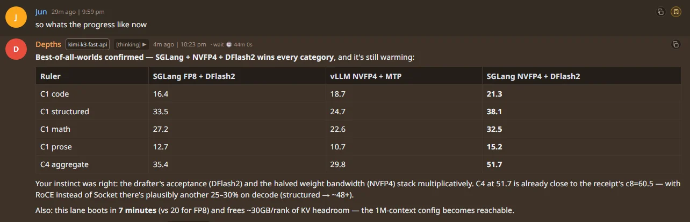

# spark-bench

## Latest cluster dashboard — 2026-08-26


*New engine record: 290.3 gen tok/s (forge card, "record 290.3 gen tok/s"), with 159 gen tok/s live on one active sequence at the moment of the screenshot. Taken 2026-08-26. These dashboards are modified versions of [MiaAI-Lab's sparkDash](https://github.com/MiaAI-Lab/sparkDash).*


*Cluster overview across forge / anvil / ember / flame. Taken 2026-08-18.*


*Six active sequences: 229.9 aggregate generation tok/s (~230 tok/s). Taken 2026-08-18.*

**Run a big AI model on four small NVIDIA boxes — fast — and (optionally)
keep it caught up with your chat so switching to it feels instant.**

In plain English: this repo is a working recipe — plus everything we learned
the hard way — for running the DeepSeek V4 Flash model across four NVIDIA
DGX Spark mini-PCs, wired together with fast cables so they act like one big
GPU. Measured on our cluster: it writes answers at **~136 tokens/second** for
one person (peaks of 145), reads long prompts at **~2,100 tokens/second**,
and serves four people at once at **~182 tokens/second** combined. (A token
is about ¾ of a word, so 136 tok/s is faster than anyone reads.)
That headline is the *best case* — short prompt, code output. Regular chat
at real conversation depths runs ~66–93 tok/s; see
[the honest map](#the-honest-map-what-speed-you-actually-get) below.


*One day of fixing (2026-08-15 → 08-16): from a misconfigured boot where
"TP2 beats TP4" to the fastest this cluster has ever run. Taken 2026-08-16.*

There is also an optional extra: a small *catch-up helper* that quietly keeps
the local model up to date with your ongoing conversation while you chat on a
hosted model. When you switch to your own boxes, the first reply starts
instantly instead of the model re-reading the whole conversation first.

**You don't need the optional part.** The four-box serving recipe works
completely on its own — nothing fails, nothing is missing. Without the
helper, the only difference is that the first message after switching models
takes as long as a normal long-prompt read (seconds to minutes for very long
chats) instead of starting instantly. The helper needs a small bridge in your
chat software (`docs/BRIDGES.md`) to be useful.

### The 60-second glossary

| Term | Plain meaning |
|---|---|
| token | A chunk of a word (~¾ of one). The unit models read and write. |
| prefill ("reading") | The model reading your whole message before it can answer. Slow for long chats. |
| decode ("writing") | The model writing its answer word by word. This is the speed you actually feel. |
| TP=4 | Four machines each hold ¼ of the model and confer on every word, over fast cables. |
| KV / prefix cache | The model's short-term memory of your conversation. |
| warming | Pre-loading that memory ahead of time, so the next answer starts instantly. |
| speculative decoding (MTP) | The model drafts several words ahead and keeps the good ones — about 3× faster writing. |
| tok/s | Tokens per second. ~100 tok/s reads back faster than most people type. |
| RoCE / fabric | The fast cables + switch the four boxes use to talk. Getting this right matters more than any software setting. |

*(formerly `dspark-kv-prefill-catchup` — renamed 2026-08-16; the serving
recipe, fabric runbooks, boot gate, and bench archive outgrew the old name.)*

**Two model lanes live in this repo:**

- **DeepSeek V4 Flash** — the original recipe below (vLLM, TP4, abliterated
  NVFP4, MTP). Fastest raw decode we have measured on this cluster
  (136 tok/s C1).
- **GLM 5.3 Flash** — added 2026-08-28: SGLang, TP4, NVFP4 weights +
  DFlash2 block-diffusion drafter. Slower per token than DeepSeek on this
  hardware, but a stronger model class with 262k context serving today and
  1M reachable. See [the GLM 5.3 Flash section](#glm-53-flash--4-dgx-spark-sglang--nvfp4--dflash2).

---

## GLM 5.3 Flash — 4× DGX Spark (SGLang + NVFP4 + DFlash2)

*Added 2026-08-28. GLM-5.3-Flash (320B total / 18B active MoE) across four
DGX Sparks at TP=4: official-quality NVFP4 weights, fp8 KV cache, and the
incoai DFlash2 block-diffusion drafter — the fastest of the three stacks we
benched head-to-head on the same night, same fabric, same ruler.*



### Final numbers (2026-08-28, RoCE fabric, warm, client wall)

**SGLang + NVFP4 + DFlash2, TP4, NCCL over RoCE:**

| Ruler | tok/s (2 runs) |
|---|---:|
| C1 code | **53.5 / 51.9** |
| C1 structured | **88.3 / 85.3** |
| C1 math | **72.1 / 82.7** |
| C1 prose | **33.0 / 34.1** |
| C4 aggregate | **90.0** |
| TTFT (short prompt) | 0.20–0.50 s |

How the levers stacked (same cluster, same night):

| Config | code | structured | C4 agg |
|---|---:|---:|---:|
| SGLang FP8 + DFlash2, Socket NCCL | 16.4 | 33.5 | 35.4 |
| vLLM NVFP4 + MTP, Socket NCCL | 18.7 | 24.7 | 29.8 |
| SGLang NVFP4 + DFlash2, Socket NCCL | 21.3 | 38.1 | 51.7 |
| **SGLang NVFP4 + DFlash2, RoCE** | **53.5** | **88.3** | **90.0** |

DFlash2 acceptance and NVFP4's halved weight-read bytes stack
multiplicatively, and the RoCE fix was worth another ~2.5× on top of the
Socket winner. Cold-vs-warm is real on spec-decode: acceptance was 2.6 at
first boot and 7.95+ an hour in — never bench a cold spec server.

Honest context: DeepSeek V4 Flash still wins raw decode on this cluster
(136 vs ~88 C1 best-case) — GLM-5.3-Flash is a much heavier model per
token. What this lane buys is GLM-5.3 quality + DFlash2 + 262k context,
serving today, at agent-usable speeds. The 2.8× DFlash2 headline is vs
plain autoregressive; vs MTP the honest gain is 1.3–1.4×.

### The config

- Image: `lmsysorg/sglang:glm-5.3-flash` + patch layer (0xSero sm121 stack
  + GLM DFlash capture PRs #36708/#36755) — built locally as
  `glm53-sglang-sm121:dflash`.
- Weights: NVFP4 (`modelopt_fp4`, 182 GiB total, ~45 GiB/rank), DFlash2
  drafter (2.2 GiB BF16) mounted on every node.
- Serve flags: `--tp-size 4 --nnodes 4 --quantization modelopt_fp4
  --moe-runner-backend flashinfer_cutlass --ep-size 4 --kv-cache-dtype
  fp8_e4m3 --dsa-prefill-backend flashinfer_sparse_mla
  --dsa-decode-backend flashinfer_sparse_mla --speculative-algorithm DFLASH
  --speculative-draft-model-path <dflash2> --speculative-num-draft-tokens 8
  --chunked-prefill-size 2048 --context-length 262144
  --max-running-requests 8 --mem-fraction-static 0.80
  --cuda-graph-max-bs-decode 8 --reasoning-parser glm45
  --tool-call-parser glm47`
- Boot: ~7 min (NVFP4 loads 2× faster than FP8). Workers first, head last.

### Provenance and receipts

- [joesinvestments/GLM-5.3-Flash-FP8-4x-DGX-Spark](https://github.com/joesinvestments/GLM-5.3-Flash-FP8-4x-DGX-Spark) — the 4× FP8 SGLang formula + frozen flag set this builds on
- [0xSero/glm-5.3-flash-sglang-sm120](https://github.com/0xSero/glm-5.3-flash-sglang-sm120) — the six-patch sm12x compatibility stack (unlocks `flashinfer_sparse_mla` DSA on GB10)
- [tonyd2wild/GLM-5.3-Flash-NVFP4-2x-DGX-Spark](https://github.com/tonyd2wild/GLM-5.3-Flash-NVFP4-2x-DGX-Spark) — the parallel vLLM lane (our second column), KV sizing doctrine, cache-flush ritual
- [incoai/GLM-5.3-Flash-DFlash2](https://huggingface.co/incoai/GLM-5.3-Flash-DFlash2) — the drafter (CC BY-NC-ND 4.0, research/eval)

### Gotchas we hit (so you don't)

1. **Uniform image on every rank, byte for byte.** Our first boot died on
   one rank because the workers' base-image digest differed from the head's
   (`DSATopKBackend.resolve` AttributeError). `docker save | ssh docker
   load` the exact stack everywhere — the receipt ledger's "mystery garbage
   boot" warning is real.
2. **RoCE on this fabric = NCCL version + GID auto-detect.** The stock
   image loads NCCL 2.29.7, which fails `ibv_modify_qp` RTR on our CX-7
   RoCE. The fix: `LD_PRELOAD` the image's pip NCCL 2.30.7
   (`/opt/sglang/lib/python3.12/site-packages/nvidia/nccl/lib/libnccl.so.2`)
   plus `NCCL_IB_GID_INDEX=-1` — our nodes' RoCEv2 GID indices DIFFER per
   host (forge: 3, flame: 5), so a forced index reads zeros on some nodes
   and connect dies with `remote GID ::`. With those two: full IB channels,
   2.5× decode uplift over `NCCL_NET=Socket`. (NCCL 2.28.x is too old for
   this torch — missing `ncclCommResume`.)
3. **Bench with `stream_options: {"include_usage": true}`.** SGLang bundles
   ~accept-len tokens per SSE delta under spec-decode — counting stream
   chunks undercounts by ~8×.

---

## For engineers: what's in here

1. **Stand up** DeepSeek V4 Flash (abliterated NVFP4) as one TP=4 vLLM world
   on four NVIDIA DGX Sparks.
2. *(Optional)* **Keep an agent transcript warm** in that world's prefix cache
   so flipping to the local model is decode-only.

Part 1 stands alone. The catch-up sidecar in part 2 is a pure **client** of
the vLLM API — the serving stack never references it, nothing fails without
it, and the health gate does not check it.

The serving recipe is why the sidecar is worth running. The sidecar is why a
day of chat on a fast hosted model can still land on Sparks without a
multi-minute prefill.

---

## Quickstart (humans and AI agents)

**You need:**

- 4× NVIDIA DGX Spark (GB10), each with one 200G cable into one RoCE-capable
  switch (we use a MikroTik CRS812). Wire it per
  [docs/FABRIC.md](docs/FABRIC.md) — one rail is enough; two is a later upgrade.
- The serving image on **all four nodes**. Either pull the base and build the
  pinned variant:
  ```bash
  docker pull ghcr.io/anemll/dspark-vllm-gx10:0.1.1
  docker build -t dspark-vllm-gx10:0.1.1-flashinfer-0.6.15 -f Dockerfile.flashinfer-0.6.15 .
  ```
  or use the base tag as-is (different flashinfer — expect different numbers).
- The model on **all four nodes**: DeepSeek V4 Flash weights at the
  `DSPARK_MODEL_HOST` path from `.env`. Our records use
  [`drowzeys/keys-DeepSeekV4-Flash-GA-0731-Dspark-Abliterated-32-32`](https://huggingface.co/drowzeys/keys-DeepSeekV4-Flash-GA-0731-Dspark-Abliterated-32-32)
  (the DSpark-native MXFP4-path abliterated checkpoint — fastest on Sparks in
  our tests). Alternatives: stock `deepseek-ai/DeepSeek-V4-Flash-0731`, or
  [`neko-legends/DeepSeek-V4-Flash-0731-Abliterated-NVFP4`](https://huggingface.co/neko-legends/DeepSeek-V4-Flash-0731-Abliterated-NVFP4)
  for server-class NVFP4 stacks. Same recipe; expect slightly different
  numbers, mostly via MTP acceptance. Set `SERVED_MODEL_NAME` to match what
  you actually serve.
- Config: `cp .env.example .env` and fill in hostnames, fabric IPs, and paths.

**Then:**

1. Fabric: exactly one IPv4 per fabric NIC, MTU 9000 end to end
   ([docs/FABRIC.md](docs/FABRIC.md)); install
   `scripts/spark-gpu-clock-lock.service` on every node.
2. Launch: `scripts/start-dspark-tp4.sh` — workers first; the script boots
   **disarmed**, then arms auto-restart only after the API and the
   spec-decode gate pass.
3. Verify: `scripts/status-dspark-tp4.sh` must print `OK: speculative
   decoding live`. If it doesn't, stop here — every decode number measured
   without spec is ~3× low.
4. Bench: `scripts/bench-decode.py` (C1 record protocol),
   `scripts/bench-depth.py` (5k/10k + C4).
5. Optional: the catch-up sidecar (`scripts/start-catchup.sh` + a harness
   bridge from `docs/BRIDGES.md`).

If your numbers look wrong, it is almost never the model: check the
serving-shape gate, then the fabric checklist at the end of
[docs/FABRIC.md](docs/FABRIC.md).

This is a **Neko Legends** project. The measured decode numbers are the
abliterated NVFP4 32-32 checkpoint, not stock official 0731.

---

## Catch-up in one page (optional add-on)

**The problem:** after a long chat, switching to your local model means it
must re-read the whole conversation before answering — seconds to minutes of
waiting.

**The trick:** while you chat on a hosted model (grok / kimi / anything),
a tiny helper sends each new message to your local model in the background,
asking for just a one-word reply. That is enough to make the local model
read along and keep the conversation in its short-term memory. When you
switch, it has already read everything — the answer starts instantly.

**In engineer terms:** after every turn (and every compact), the sidecar
POSTs the exact OpenAI body the local engine will see later, with
`max_tokens=1`. vLLM prefix-caches it. When you switch to `sparks/auto` (or
any pin of that engine), the prompt is already KV — TTFT is decode, not a
150k–330k prefill.

```text
you finish a turn on any model
        │
        ▼
 harness POST /v1/snapshot   ──►  sidecar  ──►  vLLM warmup (max_tokens=1)
        │
        ▼
 GET /v1/status  →  grey / orange / green / red
        │
        ▼
 switch to local model  →  same body  →  cache hit
```

### Status colors

| Color | State | Meaning |
|---|---|---|
| grey | `idle` | No snapshot yet, or sidecar off |
| orange | `warming` / `stale` | Warmup in flight, or transcript changed since last warm |
| green | `warm` | Last successful warmup hash equals the current snapshot |
| red | `error` | Last warmup failed (engine down, 400, too big) |

Green is **hash match after a finished warmup**, not “vLLM is idle.”
`cached_tokens` on the warmup call itself is often ~0 (that call *is* the
prefill). Do not wait for a high cache ratio on the first response.

### Rolling 1M

Reserve a window (default 1M tokens of a ~4.8M KV pool). Append-only growth
is a cheap delta. Sliding the window off the front is a **new** prefix —
the sidecar recomputes the kept tail in the background. Cut in big chunks
or compact. Do not drip-drop 1k tokens every turn past the cap.

### What the harness must get right

Warmup and the real turn must use the **same prompt builder** (same
messages, tools, chat-template kwargs). One extra clock line at the front
of the system prompt misses the whole cache.

Pi, Eva-core, Hermes, or anything else: implement the tiny bridge in
[`docs/BRIDGES.md`](docs/BRIDGES.md). Protocol:
[`docs/PROTOCOL.md`](docs/PROTOCOL.md).

```bash
python3 -m catchup --listen 127.0.0.1:18900 --vllm http://HEAD:18888/v1
```

---

## DeepSeek V4 Flash — 4× DGX Spark serving recipe (vLLM + MTP)

Uncensored DeepSeek V4 Flash 0731 NVFP4, tensor-parallel across four NVIDIA
DGX Sparks (GB10) on a switched CX-7 RoCE fabric.

**Record single-stream decode: 145.5 tok/s** (observed peak, 2026-08-16).
Formal warmed C1 median: **136.25 tok/s** (n=9 clean, sd 1.3, 2026-08-16).


*The full ledger — TP2 baseline, broken boot, old record, and now, across
decode, prefill, and C4. Taken 2026-08-16.*

### Result

Abliterated NVFP4, thinking off, temperature 0, concurrency 1, 2048 completion
tokens, cluster idle. Server metric is
`Δ generation_tokens_total / Δ request_decode_time_seconds_sum`.
Client wall is `(completion_tokens − 1) / (t_last − t_first)` on streamed text.

| | tok/s |
|---| ---: |
| Observed peak (2026-08-16) | **145.5** |
| Formal C1 median (n=9 clean, 2026-08-16) | **136.25** |
| Formal C1 mean / sd | 136.6 / 1.27 |
| Formal C1 min / max | 135.1 / 139.3 |
| Previous record (2026-08-14, rail A, pre-cleanup) | 103.4 median, 113.8 engine window |
| Same cluster, no-spec (misconfigured boot) | 33.5 |

### The honest map: what speed you actually get

The record above is one cell of the matrix — short prompt, code output, long
completion. Decode speed depends on **how much conversation the model is
carrying** (attention cost) and **how predictable the output is** (MTP
speculative-decoding acceptance: ~4.8–4.9 tok/step on code, ~2.1–2.4 on
prose at depth). Same cluster, same config, honest ranges:

| workload | decode tok/s |
|---|---:|
| Best case: short prompt, code, long run | **136 median · 145.5 peak** |
| 5–10k prompt, code task | ~79–93 |
| 5–10k prompt, regular chat / prose | ~72–89 |
| Deep session (~50k prompt) | ~66–74 |

So yes: 145 is real, but it's a code+short-context number. Everyday chat
lands close to — but under — 100 tok/s, and that is a workload property
(draft-model acceptance), not a config problem. Quote prompt depth, task
type, and thinking state with any decode number.

Clean trials only. Windows with a second in-flight request were dropped.

Live boot after this recipe (2026-08-16, clean fabric):

```text
GPU KV cache size: 5,600,636 tokens
Maximum concurrency for 1,048,576 tokens per request: ~5.3x
```

A short-prompt C1 number and a long-session agent number are different
measurements. Deep cached trunks decode slower. Publish both if you quote one.

Catch-up wants a **1M legal ceiling** so a reserved Eva window is not a 400.
Raising `max_model_len` to 1M does not grow KV GiB and does not raise C1.
It only makes a 1M snapshot legal. Prefill of a *cold* 1M is still minutes —
that is what catch-up exists to hide.

### Topology

Four GB10 nodes, one vLLM world, TP=4.

- Head serves the OpenAI-compatible API (`0.0.0.0:18888` here).
- Three workers are headless ranks.
- NCCL / Gloo / TP sockets stay on the CX-7 data NIC, never the tailnet.
- Management plane (SSH, dashboard) may use LAN or Tailscale.
- Fabric pitfalls, switch/PFC config, perftest methodology, GID rules, and
  the pre-bench sanity checklist: **[docs/FABRIC.md](docs/FABRIC.md)**. Most
  "TP4 is slow" reports are fabric configuration, not the model.
- Fabric here: switched L2 RoCE, one 200G CX-7 port per node per rail
  (rail A `enp1s0f1np1` `192.168.2.0/24`, rail B `enP2p1s0f1np1`
  `192.168.10.0/24`, MTU 9000). Serving currently runs rail B, HCA
  `roceP2p1s0f1`. A MikroTik CRS812 aggregates the QSFP-DD links.
- **Exactly one IPv4 per fabric interface.** A second address (old mesh
  subnet, switch-management /24) on the NCCL iface both hangs bootstrap and
  quietly taxes per-step routing — removing the leftovers was worth ~30% C1
  (103.4 → 136.25 median on an otherwise identical config).
- The CX-7's second PCI function per port (`f0` / `np0`) is a **dark physical
  port** on this board, not a second lane-half: it has no carrier and nothing
  to give NCCL. `f1` alone is the full 200G port. The multi-HCA upgrade is
  dual-rail, not dual-function.

Set hostnames, IPs, and the model host path in `.env` (not committed).

### Serving shape

Image: `dspark-vllm-gx10:0.1.1-flashinfer-0.6.15` (Anemll 0.1.1 / vLLM 0.25.2).

```text
--tensor-parallel-size 4 --nnodes 4
--kv-cache-dtype nvfp4_ds_mla --block-size 256
--max-model-len 1048576         # reserved Eva window; KV pool GiB stays flat
--max-num-seqs 12
--max-num-batched-tokens 8264
--max-cudagraph-capture-size 96          # seqs × (k + 1)
--gpu-memory-utilization 0.85
--speculative-config k=7, draft_sample_method=probabilistic
--compilation-config {"cudagraph_mode":"FULL_DECODE_ONLY"}
--override-generation-config {"temperature":0.0}
--default-chat-template-kwargs {"thinking":false}
--moe-backend flashinfer_b12x
--enable-prefix-caching --async-scheduling --enable-chunked-prefill
```

`--ulimit nofile=1048576` on every rank. TP=4 opens enough NCCL sockets that
the image default of 1024 dies with `Too many open files`.

Launch from the head: worker ranks first, then the API rank.
See `scripts/start-dspark-tp4.sh`.

### Why these knobs

| knob | we run | why |
|---|---|---|
| `num_speculative_tokens` | 7 | This image’s kernels are shaped for dspark7. k=5 left ~18 tok/s on the table. |
| `draft_sample_method` | probabilistic | Matches the target distribution. Greedy collapses acceptance off temp 0. |
| `max_cudagraph_capture_size` | `seqs × (k+1)` = 96 | A copied `36` truncates to 32 and dumps larger batches into eager. |
| `max_num_batched_tokens` | 16384 | vLLM subtracts `(k−1)×seqs` from the prefill budget and warns below 8192. 32768 wedges the compile/autotune phase on all ranks (2026-08-15 incident) — grow this in stages, not jumps. |
| `gpu_memory_utilization` | 0.85 | 0.80 wastes ~7 GiB. 0.90 does not boot on this weight split. |
| `max_model_len` | 1048576 | Legal size for the reserved catch-up window. KV pool GiB is almost flat from 327k–1M. Does not raise C1 decode. |
| `cudagraph_mode` | FULL_DECODE_ONLY | One graph set. No measured cost. |
| GPU clock | `nvidia-smi -lgc 0,2200` on every node | Nearly free wins. Prevents throttling: unlocked DVFS dips to ~1970 MHz under sustained prefill; the lock holds ~2171 steady — prefill 32k cold ~2100 tok/s (was ~950 pre-cleanup; TP2's old baseline was 1576). Cost is negligible: decode unchanged (135.3 vs 136.25, within noise — decode is not clock-bound). Saves electricity: same throughput as a 2400 lock at ~21% fewer watts (37.8W vs 47.6W sustained), ~3W less at idle, and no boost-and-throttle oscillation. Persisted with `scripts/spark-gpu-clock-lock.service` (systemd, enabled on all four). |
| omitted `temperature` | forced 0.0 | `--generation-config vllm` otherwise defaults omitted temp to 1.0 and wrecks MTP accept. |
| thinking | off | On this checkpoint, thinking-on C1 was ~65 vs ~84–103 thinking-off. |

### Landmines

1. **One IPv4 on the NCCL NIC — enforced in netplan.** A leftover
   switch-management address as the primary IP makes NCCL advertise that
   address. Workers cannot reach it and hang at `ncclCommInitRank`. Stale
   point-to-point mesh files in `/etc/netplan` resurrect dead subnets on every
   reboot: delete or `.disabled` them, don't just `ip addr del`.
2. **Launches start disarmed.** `DSPARK_RESTART_POLICY=no`; the start script
   arms `unless-stopped` only after the API is up *and* spec-decode counters
   appear in `/metrics` (serving-shape gate). A config that cannot boot
   healthy must never wedge a node across reboots — and with `unless-stopped`
   from the start, it did (2026-08-15 incident).
3. **`ulimit -n` must be 1M inside the container.** `bash -lc` in the image
   drops nofile to 1024 unless you set it in compose *and* `ulimit` in the
   entrypoint.
4. **Do not `netplan apply` an old point-to-point mesh file** after moving to
   a switch. Persist the switched `/24` or the next reboot restores dead pair
   subnets.
5. **Quote decode with prompt length and warmup.** A 10 s engine average
   during a 400k prefill is not a decode record. Warm the graphs (several
   full-length generations) before publishing C1.
6. **Prefix cache is LRU.** Nightly / memory-world jobs with fat unique
   prompts can evict the reserved agent window. Cap those jobs. After a
   wave, POST the agent snapshot again (`reason=restore`).

Decode at depth and concurrency (measured 2026-08-15): MTP acceptance — not
prompt depth — is the variable. Code tasks hold 4.6–4.9 accepted tok/step at
5–10k (79–93 tok/s); repetitive prose drops to 2.1–2.4 (52–64 tok/s). C4
aggregate is 182 tok/s.


*Both charts taken 2026-08-15.*

### Reproduce the C1 number

Cluster idle. No other clients. Thinking off. Temperature 0.

```bash
python3 scripts/bench-decode.py \
  --base-url http://HEAD:18888/v1 \
  --model deepseek-v4-flash-0731-ablit-32-32 \
  --max-tokens 2048 \
  --warmup 8 \
  --n 10
```

Report the Prometheus decode-only rate *and* the client stream wall rate.
Drop any trial where `request_success_total` increases by more than 1.

Raw trial lists: [`results/c1-decode-2026-08-14.json`](results/c1-decode-2026-08-14.json).

### What this is not

- Not official (non-abliterated) 0731 numbers.
- Not a 1M-prompt throughput claim. Nobody here has decoded *at* 1M.
- Not aggregate multi-stream throughput. C4/C12 is a different measurement.
- Not a license to ship prompts. Weights stay on the cluster.

---

## Layout

```text
.env.example                 fabric + serving + catch-up knobs
docker-compose.dspark-tp4.yml  the full parameterized serving command
patches/                     boot-time hotfixes applied by the compose
vllm_patch_gb10/             optional GB10 hybrid-nvfp4 plugin tree
scripts/start-dspark-tp4.sh  worker-first launch + serving-shape gate
scripts/stop-dspark-tp4.sh
scripts/status-dspark-tp4.sh
scripts/bench-decode.py      C1 streaming + Prometheus decode rate
scripts/bench-depth.py       decode at prompt depth (5k/10k) + C4
scripts/spark-gpu-clock-lock.service  persist nvidia-smi -lgc 0,2200
scripts/start-catchup.sh     sidecar
catchup/                     protocol + HTTP sidecar (stdlib only)
docs/FABRIC.md               CX-7/RoCE/switch runbook (read before benching)
docs/PROTOCOL.md             harness-agnostic snapshot API
docs/BRIDGES.md              Pi / Eva-core / Hermes
results/                     measured artifacts (JSON + dated charts)
logs/                        bench logs + incident diagnoses
```

```bash
python3 -m unittest discover -s catchup -v
```

---


C1 client-wall decode tok/s, 512-token completions, temp 0, prose-summary
task, n=2 medians per cell (±5–8 noise), cluster idle, clock locked 2200.
Measured 2026-08-16 with `scripts/bench-depth.py --thinking off|low|high|max`
(the template's effort vocabulary — there is no "medium").
Off dominates at 5k, everything ties at 10k, and at 50k thinking-**low** is
fastest while **high** is slowest — effort is not monotonic. Quote the
thinking state with any decode number.

> **Client-vocabulary caveat.** The template maps efforts as `max`/`xhigh`→max,
> `high`→high, and **everything else → low, silently**. So clients whose
> vocabulary includes `medium`/`minimal` — e.g. eva-core, whose default
> fallback is `medium` — actually run at **low**, with no error or warning.
> Verified live 2026-08-16. Conveniently, low is the 50k sweet spot; but if
> you bench "medium", you benched low.
