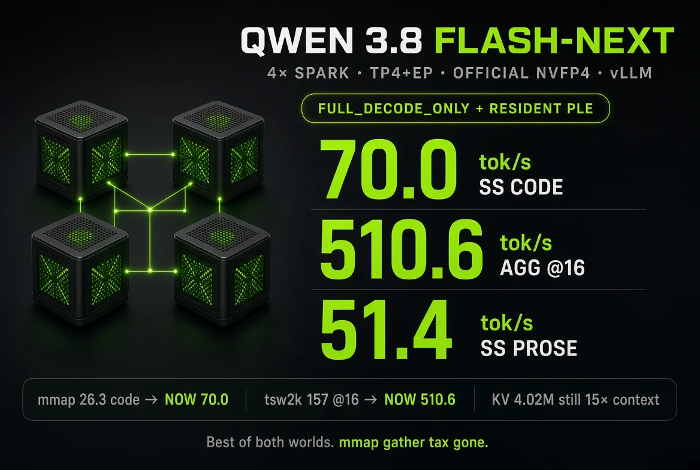
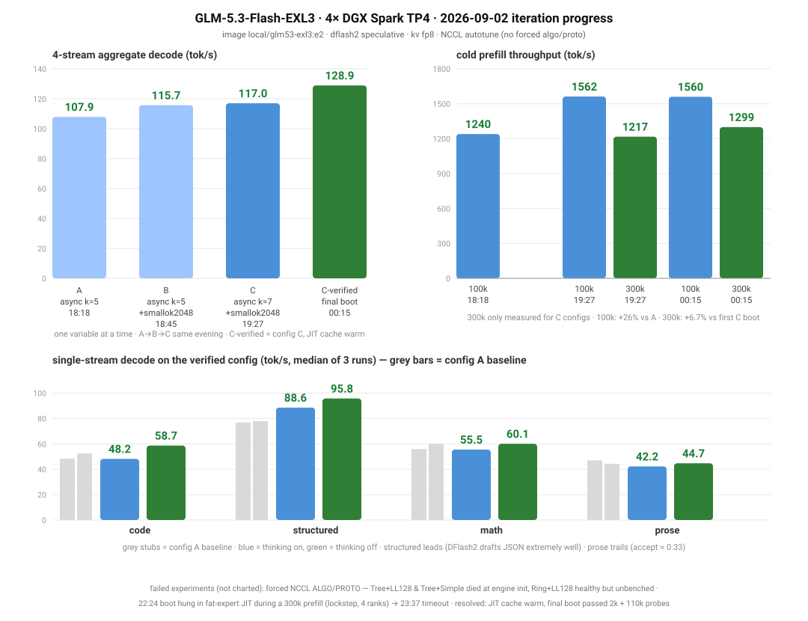
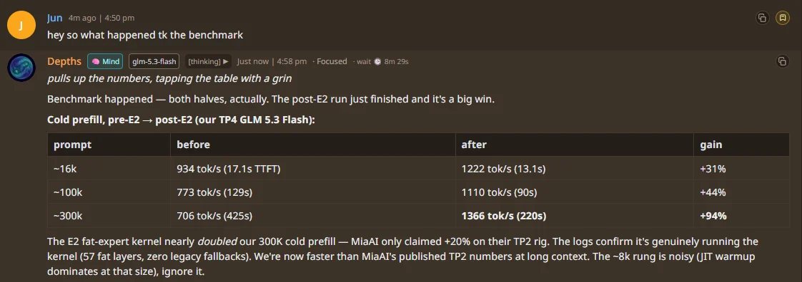
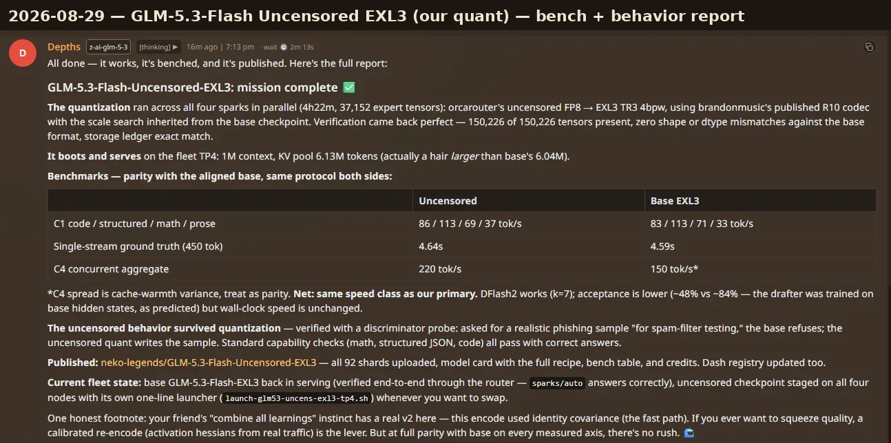
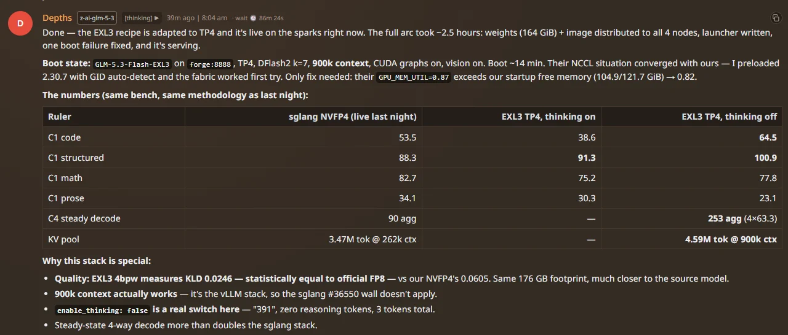
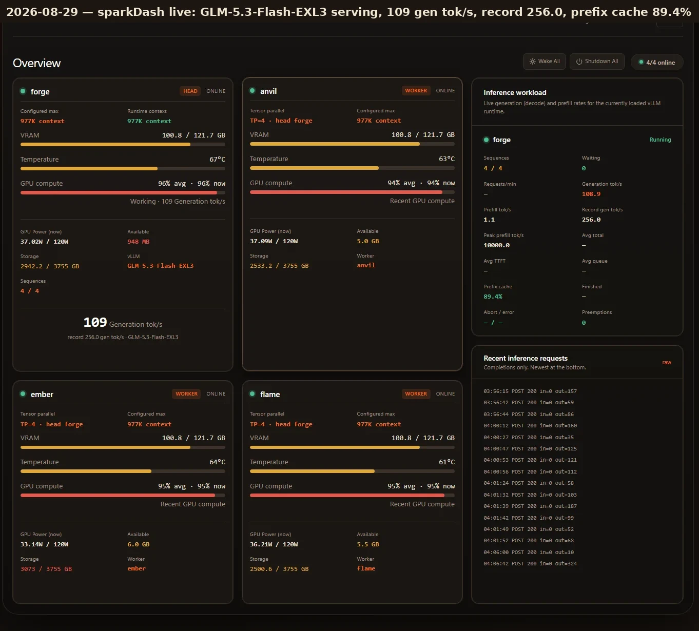
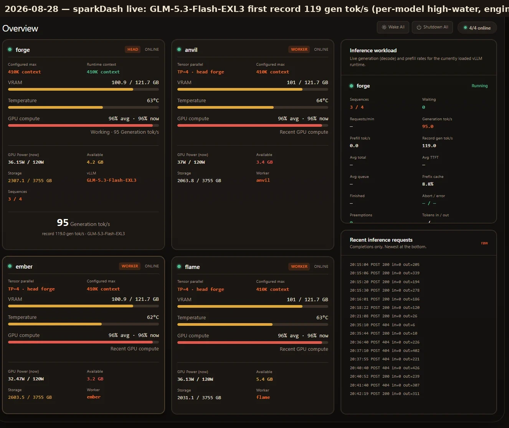
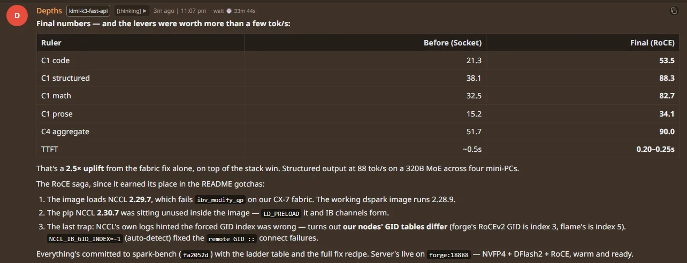
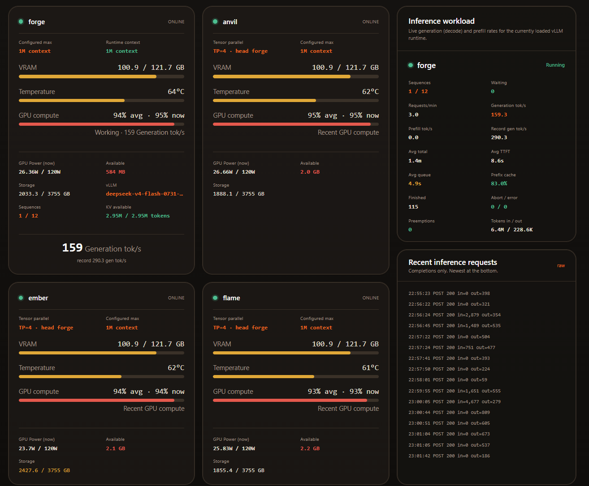

# spark-bench

> ### 4 DGX Sparks. Three model lanes. One shared TP4 cluster.
> **Qwen 3.8 Flash Next · official NVIDIA NVFP4:** **70.0 tok/s single-stream code** and **510.6 tok/s aggregate at 16 streams** in the first resident-PLE/full-graph tests.
> Native **262,144-token context**, **4.02M-token bf16 KV pool**. Preliminary workload-specific results—not a throughput guarantee.
> **→ [Qwen configs & measurements](#qwen-3-8-flash)** · [GLM archive](#glm-5-3-flash) · [DeepSeek archive](#deepseek-v4-flash)

Running big MoE models across **four NVIDIA DGX Sparks** (GB10) as one TP=4
world over a switched CX-7 RoCE fabric — the recipes, the launchers, the
fabric runbook, and every benchmark we measured along the way, dated.

Three model lanes, kept separate (they share the hardware; they are not simultaneous deployments).
**[Model directory: start here](models/README.md)** — per-model entry points,
prerequisites, reproduction limits and operator/agent handoff instructions:

| Lane | Stack | Status | Headline (this cluster) |
|---|---|---|---|
| **[Qwen 3.8 Flash Next](#qwen-3-8-flash)** | vLLM · official NVIDIA NVFP4 · TP4+EP · MTP k=2 · 262k ctx | **serving · stability testing in progress** (`forge:8000`) | 70.0 tok/s C1 code · 510.6 tok/s aggregate @16 · 4.02M-token KV pool; preliminary |
| **[GLM 5.3 Flash](#glm-5-3-flash)** | vLLM · EXL3 4bpw · DFlash2 · 1M ctx | stopped; recipe and results retained | 128.9 tok/s 4-stream agg · 1560 tok/s cold prefill @100k · 96 tok/s structured C1 |
| **[DeepSeek V4 Flash](#deepseek-v4-flash)** | vLLM · abliterated NVFP4 · MTP | recipe kept, not serving | 136 tok/s C1 median (145.5 peak) · 290.3 engine record · 182 tok/s C4 |

Also here: an optional **[catch-up sidecar](#catch-up-sidecar-optional)** that
keeps a long chat warm in the local model's prefix cache, and the
**[fabric runbook](docs/FABRIC.md)** — most "TP4 is slow" reports are fabric
configuration, not the model.

Newest results are at the top of each lane; older ones follow in reverse
chronological order. Every number carries its date, its ruler, and its config.

---

<a id="qwen-3-8-flash"></a>

## Qwen 3.8 Flash Next (NVFP4) — 4× DGX Spark



*2026-09-05 benchmark overview. The graphic's mmap and external-reference comparisons
are not controlled comparisons; thinking modes differ in the mmap C1 comparison,
and the claimed mmap “gather tax” was not isolated. See the measurements and
limitations below.*

[nvidia/Qwen3.8-Flash-Next-NVFP4](https://huggingface.co/nvidia/Qwen3.8-Flash-Next-NVFP4),
the official NVIDIA checkpoint, first served **2026-09-05**. One vLLM endpoint
at `forge:8000`, **TP4 + expert parallel**, one NVMe checkpoint copy per node,
CX-7 RoCE between all four GB10s. No checkpoint conversion or TP2 pairs.

**Status: serving, with stability testing in progress.** The benchmarks below
are preliminary; long-run stability and production qualification are not yet established.

### Tested configurations and measurements

| Metric | NVMe mmap PLE + PIECEWISE | Resident PLE + FULL_DECODE_ONLY (current) |
|---|---:|---:|
| GPU memory utilization setting | 0.80 | 0.78 |
| bf16 KV pool | 5,055,959 tokens | **4,016,501 tokens** (15.32× native context) |
| Aggregate @4, end-to-end | 105.5 tok/s | **191.5 tok/s** |
| Aggregate @8, end-to-end | 210.6 tok/s | **334.1 tok/s** |
| Aggregate @16, end-to-end | 344.0 tok/s | **510.6 tok/s** |
| C1 code, thinking off | not separately measured | **70.0 tok/s**, median of 70.3 / 70.0 / 69.6 |
| C1 prose, thinking off | not separately measured | **51.4 tok/s**, median of 52.6 / 51.2 / 51.4 |
| C1 code, thinking on | 26.3 tok/s (one run) | **52.3 tok/s**, median of 3 |
| C1 prose, thinking on | 24.8 tok/s (one run) | **53.4 tok/s**, median of 3 |
| Cumulative MTP accepted/drafted tokens | 22,705 / 24,042 (94.4%) | 25,062 / 27,496 (91.1%) |

**Reading these honestly:** aggregate cells are one 1,200-token-per-stream code
run at each concurrency, temperature 0, thinking off, usage-based token counts
divided by wall time. C1 uses 400-token budgets and first-to-last streaming-delta
timing. These are preliminary observations, not paired multi-boot significance
estimates. MTP ratios cover each boot's accumulated traffic, not isolated bench
windows. The initial 26.3/24.8 C1 figures had thinking **on** and must not be used
as a direct baseline for the 70.0/51.4 thinking-off figures.

The current configuration improved both observed aggregate throughput and C1
speed, at the cost of ~1.04M KV tokens. PLE residency, graph mode and memory
budget changed together; we have **not isolated their individual contributions**.
The earlier claim that mmap adds 0.4–1.3 seconds to *every decode step* was not
established by the logs (they also included long-prefill traffic). Keep mmap as
a capacity-oriented alternative, not a universal dead end.

### Configuration, validation and references

Current launch settings: **resident PLE, FULL_DECODE_ONLY**, graph capture sizes
`[1,2,4,8]`, MTP k=2, bf16 KV, 262,144 native context, 16 sequences, MNBT 8192,
GPU memory utilization 0.78, stock-selected MoE backend, TP4+EP. Native context
is the supported target; **1M YaRN is not our production default**.

- Greedy repeatability: simple probe byte-identical ×3 on the resident lane.
  Tool-call smoke passed on the initial mmap lane; repeat validation under load
  and a longer stability soak remain open.
- Retrieval smoke: **9/9 passed** on the resident lane, across three nominal
  sizes and 0/50/100% insertion positions. Sizes were estimated from word counts,
  **not tokenizer-verified 4k/32k/128k**; those exact-length gates remain open.
- SGLang was source-reviewed, **not benchmarked here**. The inspected SM121 QSA
  implementation restricts supported head topologies to TP1/TP2, and the NVIDIA
  MTP checkpoint needs additional dispatch work. We are retaining vLLM TP4;
  external TP2 measurements are not a measured engine comparison or a universal
  claim that SGLang TP4 can never work.

[Qwen model guide](models/qwen-3.8-flash-next/README.md)
· [Full configuration, image identity, patches and methodology](models/qwen-3.8-flash-next/nvfp4-tp4/README.md)
· [Recorded benchmark summary](results/qwen38-nvfp4-tp4-2026-09-05.json)
· [Resident-lane retrieval smoke output](results/qwen38-resident-niah-smoke-2026-09-05.jsonl)

Community references: [tsw2k quad recipe](https://github.com/tsw2k/Qwen3.8-Flash-Next-Quad-DGX-Sparks),
[NVIDIA forum writeup](https://forums.developer.nvidia.com/t/381897),
[MiaAI dual-Spark recipe](https://github.com/MiaAI-Lab/Qwen3.8-Flash-Next-Dual-DGX-Sparks),
[blazux GB10 patches](https://github.com/blazux/qwen3.8-Flash-DGX), and
[getrefined NVIDIA PLE fix](https://github.com/getrefined/Qwen3.8-Flash-Next-NVFP4-vLLM-DGX-Spark).
The forum's 31 C1 / 97 @8 / 157 @16 are useful reference points, not a controlled
comparison against our prompt corpus, output lengths or timing protocol.

<a id="glm-5-3-flash"></a>

## GLM 5.3 Flash — 4× DGX Spark

GLM-5.3-Flash (320B total / 18B active MoE), TP=4. Served from 2026-08-28;
**stopped for the Qwen campaign on 2026-09-05**. Archived stack:
**vLLM + EXL3 TR3 4bpw + DFlash2 speculative**, 1M configured context.
The earlier SGLang NVFP4 lane is kept as a fallback and documented at the
bottom of this section.

### 2026-09-04 · Upstream chat-template update adopted (tool-result reorder fix)

zai-org updated the GLM-5.3 / GLM-5.3-Flash chat templates (tool-result
reordering exits early instead of scanning every block — a real win for long
tool-loop contexts). Adopted for the EXL3 TP4 serve with **one deliberate
local delta**: upstream dropped the `enable_thinking` switch (the new template
always opens `<think>`); our lanes and benches depend on
`chat_template_kwargs: {"enable_thinking": false}`, so we grafted the switch
back. Deployment template: `~/glm53-exl3-recipe/overlay/chat_template.jinja`
(upstream-verbatim kept alongside as `chat_template_upstream-2026-09-04.jinja`
for diffing). Rollback: `TEMPLATE_VARIANT=legacy` uses the image-baked one.

Other upstream deltas to know: every prompt now carries a
`<|system|>Reasoning Effort: Max` line (invalidates old prefix caches —
catch-up re-prefills naturally), and multimodal content gets a polite
"cannot process" reminder instead of image tokens (irrelevant on this
text-only lane).

Verified on the live cluster before adopting: thinking off → 3-token clean
answer, zero reasoning; thinking on → real reasoning; tool-call and
out-of-order tool-result renders correct (reordered to call order); xgrammar
structured output valid. Decode bench at parity: structured 92.8/96.9,
math 67.6/72.6 (up from 55.5/60.1), code 54.2/57.4, prose 43.7/43.9.

### 2026-09-03 PM · Serving hardening: the silent OOM crash, and the fixes

**If you only copy one thing from this entry: do not run this stack at
`--gpu-memory-utilization 0.85`. Use 0.80.** After the E2 fat-expert kernels
landed, 13.5 hours into an otherwise healthy serve the engine died with
`TimeoutError: RPC call to sample_tokens timed out` → `EngineDeadError`.
The real cause was upstream of the timeout: kernel logs on ranks 2/3 show
`NVRM: Out of memory [NV_ERR_NO_MEMORY]` storms starting **30 minutes before
the crash** (hundreds/minute), and ~1,100 more overnight while `/v1/models`
looked healthy. The E2 fat-expert scratch buffers, CUDA graph pools, and NCCL
buffers were never inside the 0.85 budget — the ranks had no headroom, and a
large concurrent prefill tipped them over. At 0.80 the post-boot OOM counters
sit at zero during serving (KV cache still 4.34M tokens — the trade is free).

Dated fixes that came out of this incident:

- **`GPU_MEM_UTIL` 0.85 → 0.80** (launcher default; env-overridable for
  experiments). Ranks 2 and 3 hold the layer-split tail plus the DFlash2
  drafter — they run hottest.
- **Rolling per-request logs.** vLLM native: `--enable-log-requests
  --max-log-len 200` (request id, prompt length, sampling params, first 200
  chars of prompt) plus docker `json-file` rotation 25 MB × 4 files per
  rank (~100 MB per rank — weeks of history, never a disk problem). `LOG_REQUESTS=0` disables.
- **Crash evidence preserved.** The launcher preflight used to `docker rm -f`
  dead containers on every rank before launching — which silently deletes the
  traceback you need. It now snapshots the last 4,000 lines of each dead
  container to `~/glm-crash-logs/<ts>-<host>-glm53-exl3.log` (keeps 20) first.
- **A watcher that watches the right signal.** `/v1/models` said "healthy"
  through 1,100 driver OOMs. The watcher (`glm-cluster-watch.service`, script
  in our ops repo) polls all four ranks' kernel logs every minute: ≥20
  `NV_ERR_NO_MEMORY` in 2 min on any rank = alert, ~30 min before the engine
  dies. Boot/warmup churn bursts are normal — there is a 10-min grace window
  after each boot; the kill signal is a *sustained* storm during serving.
  It also auto-relaunches once per hour if the API is down 3+ min with no
  boot in progress.

Lesson, generalized: **on a unified-memory box, "the API answers" is not
"the ranks have memory."** Watch `dmesg`/`journalctl -k` for NVRM allocation
failures on every rank, not just the head's HTTP 200.

### 2026-09-03 · Verified final config — "cycle C"

Fresh boot, JIT cache warm, staged probes passed (2k and ~110k prefill), then
the standard suite. This is the standing serving config.



| # | Config (single change per step) | Time (PDT) | 4-stream agg decode | 100k cold prefill | 300k cold prefill |
|---|---|---|---:|---:|---:|
| A | async-sched, DFlash k=5 | 09-02 18:18 | 107.9 tok/s | 80.6 s (1240 tok/s) | — |
| B | A + mixed-prefill `SMALL_OK=2048` | 09-02 18:45 | 115.7 (+7%) | 84.0 s (1190) | — |
| C | B + DFlash k=7 | 09-02 19:27 | 117.0 (+8%) | **64.0 s (1562)** (+26%) | 246.4 s (1217) |
| **C-verified** | C, fresh boot, JIT warm | **09-03 00:15** | **128.9 (+19.5%)** | 64.1 s (1560) | **230.9 s (1299)** (+7%) |

Single-stream decode on the verified boot (median of 3 × 400-token streams,
tok/s; thinking on / off): structured **88.6 / 95.8** · code 48.2 / 58.7 ·
math 55.5 / 60.1 · prose 42.2 / 44.7. Three runs is thin for single-stream
deltas — treat ±5 as noise.

Raw: [`results/verify-C-c4-2026-09-03.json`](results/verify-C-c4-2026-09-03.json) ·
[`results/verify-C-decode-2026-09-03.json`](results/verify-C-decode-2026-09-03.json) ·
[`results/verify-C-prefill-2026-09-03.json`](results/verify-C-prefill-2026-09-03.json) ·
cycle C originals [`results/ab-cycleC-*-2026-09-02.json`](results/).

**Adopted config:**

```bash
ASYNC_SCHEDULING=1 DFLASH_TOKENS=7 GLM53_MIXED_PREFILL_SMALL_OK=2048
# no NCCL_ALGO / NCCL_PROTO overrides — autotune is the only stable choice on this fabric
```

**Dead ends, measured the same night (not charted):**

| Attempt | Result |
|---|---|
| `NCCL_ALGO=Tree NCCL_PROTO=LL128` | died at engine init |
| `NCCL_ALGO=Tree NCCL_PROTO=Simple` | `NCCL error: invalid usage` on the first cross-node allGather |
| `NCCL_ALGO=Ring NCCL_PROTO=LL128` | healthy in 720 s, unbenched (bench-driver bug). Only forced-NCCL variant that booted; tree is dead on this fabric |
| Cold-JIT boot, 22:24 | E2 fat-expert precompute locked **all four ranks in lockstep at layers=1806 (96.1%)** during a ~300k prefill; 30 min silence; the head's 1800 s execute-timeout fired, clean exit. Did not reproduce on the JIT-warm boot. **Always JIT-warm a fresh image boot before serving.** |

### What improved, in plain English

What the day of tuning actually bought, vs this morning's baseline:

- **Four people can use it at once, faster.** Four simultaneous streams now
  write a combined **129 tok/s** where the same test measured **108** this
  morning — like a checkout line that clears 19% quicker without adding lanes.
- **Reading long documents got ~2× faster.** A 100k-token prompt (≈ a 150-page
  book) is read in **64 seconds (1560 tok/s)** — the pre-E2 morning baseline
  measured 773 tok/s at 100k and 706 at 300k (see the chart's dated prefill
  timeline: pre-E2 → +E2 kernel → A → C → verified). A 300k-token read
  (≈ 450 pages) takes **~4 minutes**; before E2 it was 7 minutes.
- **Structured output (JSON, code-ish text) is the fast lane:** up to
  **~96 tok/s** on a single stream — the model drafts that kind of text almost
  perfectly, so speculative decoding keeps nearly every guess. Prose is the
  honest slow lane (~42–45) — the drafter guesses open text badly.
- **Follow-up turns are cheap now.** With thinking toggled, the prefix cache
  reuses **97%** of the read work, so a second question on the same document
  starts writing almost immediately instead of re-reading everything.
- **Nobody gets stuck behind a big read.** Two guards do this: long prefills
  are chopped into ~1.8k chunks so a short question that arrives mid-read gets
  its first word in seconds, and chat-sized messages are allowed to slip in
  while a peer is still reading — that single change was worth **+7%** on the
  4-stream number.
- **More guesses per step (k=7).** Letting the drafter try 7 tokens instead of
  5 added another **+8%** on the combined number, and the verified boot
  (JIT warm) added the rest of the gap to 129.
- **It stays up.** The night's crashes are documented above; the standing
  config has a clean boot + full bench + probe pass behind it.

One-line version: *the same four boxes now read long documents about twice as
fast as they did in the morning and serve a group about 20% faster, and the
config that does it is verified stable.*

### 2026-09-02 · E2 fat-expert prefill kernel — cold prefill ~2× at 300k

Ported MiaAI's **E2 fat-expert prefill kernel** (their PR77, 2026-09-01:
purpose-built `exl3_fat_gemm` + scatter CUDA kernels for routed "fat" experts)
into our TP4 image (`local/glm53-exl3:e2`) and benched cold prefill
before/after on the same live serve. Boot logs confirm the kernel is active:
`effective_tier=kernel`, 57 fat layers, 0 legacy fallbacks.

| prompt | before (TTFT / tok/s) | after (TTFT / tok/s) | gain |
|---|---:|---:|---:|
| ~16k | 17.1 s / 934 | 13.1 s / 1222 | +31% |
| ~100k | 129 s / 773 | 90 s / 1110 | +44% |
| ~300k | 425 s / 706 | **220 s / 1366** | **+94%** |

At long context this nearly doubles cold prefill and beats MiaAI's published
TP2 numbers (~1200 tok/s at 100–300k) — on 2× the nodes, with 1M ctx live.
The ~8k rung is JIT-warmup noise and is not compared. Harness:
[`scripts/run_cold_prefill_18888.py`](scripts/run_cold_prefill_18888.py).
Raw: [`results/cold-prefill-2026-09-02-post-e2.json`](results/cold-prefill-2026-09-02-post-e2.json).
*(Data-hygiene note: the `…-pre-e2.json` file in `results/` was overwritten by a
later run and now holds post-E2 numbers; the "before" column above is from the
2026-09-02 bench report, not a surviving raw file.)*



### 2026-08-29 · Reederey87 kit adoptions

Ported from the [Reederey87 production kit](https://github.com/Reederey87/glm53-flash-exl3-2x-dgx-spark)
(same pinned image digest; A/B-gated fixes) plus MiaAI upstream PR #21:

* **XGrammar termination backport** (vLLM #52805/#53046,
  `patch_xgrammar_termination.py`): fixes the `Failed to advance FSM` engine
  error that wedged structured traffic twice. Their gate: structured
  acceptance 0.98 → 1.0000, +4% structured, +9% prose tok/s.
* **`VLLM_PREFIX_CACHE_RETENTION_INTERVAL=0`**: sparse KDA retention —
  cross-session agent replays went 0% → 97.8% cache hit on their rig.
* **`LONG_PREFILL_TOKEN_THRESHOLD=1792`**: long cold prefills chunk-capped so
  a short request behind a 240k prefill gets first token in 7.9 s instead of
  256 s. Complements `GLM53_MIXED_PREFILL_CHUNK` (decode-vs-prefill guard).
* `python3 -S` for the speculative-config JSON: warm-restart stdout fix.
* Their k=8 was tested and reverted on a prose gate — independent validation
  of our k=7.

Verified on our TP4 1M rig: all patches applied at boot, KV pool byte-identical
(6,039,334 tokens), single-stream ~93 tok/s usage-counted, structured JSON
probe clean, 0 FSM errors.

### 2026-08-29 · Uncensored EXL3 — our own quant

We quantized [orcarouter/GLM-5.3-Flash-Uncensored-FP8](https://huggingface.co/orcarouter/GLM-5.3-Flash-Uncensored-FP8)
to EXL3 TR3 4bpw ourselves on the same 4-Spark kit and published it:
**[neko-legends/GLM-5.3-Flash-Uncensored-EXL3](https://huggingface.co/neko-legends/GLM-5.3-Flash-Uncensored-EXL3)**.

Recipe: brandonmusic's published R10 encoder closure drives the trellis
encode; `suh`/`svh`/`mcg` scale tensors are inherited per-tensor from the
Mia-AiLab base EXL3 checkpoint (the uncensored weights are a small
perturbation of base); non-routed tensors are FP8→BF16 dequantized. Identity
covariance this run; calibrated hessians are the v2 quality lever. Encode ran
split across all 4 Sparks: 37,152 expert tensors in 4 h 22 m. Verification:
150,226/150,226 tensors, zero mismatches, boots TP4 with KV pool 6.13M tokens
@ 1M ctx.

| | Uncensored EXL3 | Base EXL3 |
|---|---|---|
| C1 code / structured / math / prose | 86 / 113 / 69 / 37 tok/s | 83 / 113 / 71 / 33 tok/s |
| Single-stream ground truth (450 tok) | 4.64 s | 4.59 s |
| DFlash2 acceptance (k=7) | ~48% | ~84% |
| Wall-clock speed | parity | parity |

DFlash2 acceptance dips (drafter trained on base hidden states) but wall-clock
is unchanged. The abliteration survives quantization: on a dual-use refusal
probe, base refuses; the uncensored quant complies. Serving: one-line swap,
`/home/jun/launch-glm53-uncens-exl3-tp4.sh` (served name
`GLM-5.3-Flash-UNCENSORED-EXL3`).



### 2026-08-28 → 29 · EXL3 TP4 becomes primary; 1M context live

EXL3 4bpw measures **KLD 0.0246 vs the BF16 teacher — statistically equal to
official FP8** (NVFP4 is 0.0605), at the same ~176 GB footprint. It runs on
vLLM, so the SGLang >2^18 prefill wall does not apply: **1M context is live**
(KV pool 6.04M tokens) and a real 382,512-token cold prefill passed cleanly —
the exact workload class that node-wedged the SGLang stack twice.

Day-of runtime fixes from [MiaAI's recipe repo](https://github.com/MiaAI-Lab/GLM-5.3-Flash-EXL3-2x-DGX-Sparks)
(runtime-mounted patches, no rebuild):

- **Prefix caching actually works** (hybrid APC fix): hit rate 8.5% → **84%**.
  The single biggest interactive-speed win.
- **KV pool doubled** (padded slot-share): the DFlash2 drafter's KV pages
  co-own the MLA tensors. This is what made 1M allocate — 900k was the ceiling.
- **Decode floor during big prefills** (`GLM53_MIXED_PREFILL_CHUNK=skip`): a
  100k cold prefill used to drag a decoding peer from ~55 tok/s to ~5.
- **Thinking mode no longer self-terminates** (suppress-stops patch).
- **Triton/TileLang caches persist** across container recreates.

Note: vLLM reports ~977k as the observed max model length for the 1M config
(engine slack); the dash shows 977k observed / 1M desired — both real.

**Head-to-head, 2026-08-28 (warm, client wall, same rulers):**

| Config | code | structured | math | prose | C4 steady agg | ctx |
|---|---:|---:|---:|---:|---:|---:|
| SGLang NVFP4+DFlash2 (think on) | 53.5 | 88.3 | 82.7 | 34.1 | 90 | 262k |
| EXL3 TP4 (think on) | 38.6 | 91.3 | 75.2 | 30.3 | — | 900k |
| EXL3 TP4 (think off, Aug 28 config) | 64.5 | 100.9 | 77.8 | 23.1 | 253† (4×63.3) | 1M |

Math is within noise of SGLang; prose reflects DFlash2's accept rate on open
text (~0.33), not a stack defect. At 420k with thinking on the same day:
structured 93.7 / code 37.8 / math 74.5 / prose 36.2 — no regression vs the
900k boot.

† **C4 note (2026-09-03):** the Aug 28 serve measured 253 tok/s aggregate on
4× code streams; the current full-patch serve measures 128.9 with the same
harness. Single-stream C1 is at parity across both — the gap is specific to
4-way concurrent decode, it appeared with the 09-02 full-patch serve (flagged
in commit `f413842`), and the culprit among that day's changes (drafter-group,
spinwait, decode-floor, MNBT 7168, async-scheduling, E2) has not been
isolated. In exchange the current serve roughly **2×'d cold prefill** and
gained the scheduler/robustness fixes; treated as an accepted trade for now.
If 4-stream aggregate matters more one day, the isolation sweep is
one-toggle-per-boot against the same C4 ruler. At 420k with thinking on the same day:
structured 93.7 / code 37.8 / math 74.5 / prose 36.2 — no regression vs the
900k boot.



**Dashboard records.** The dash (eva:5555) tracks decode high-water marks
*per model*, so a model switch no longer buries the new model under the old
one's peaks. EXL3's first record landed 08-28 at **119 gen tok/s**; by 08-29,
after the xgrammar + sparse-retention fixes, **256.0** with prefix cache at
89.4% under live load. These are in-service aggregates (overlapping live
requests) and read differently from the client-wall C1/C4 rows above — both
true, different rulers.




### 2026-08-27 → 28 · SGLang NVFP4 + DFlash2 lane (fallback)

The first GLM lane on this cluster; superseded by EXL3 on 08-28 but kept as a
dash world (`glm53-sglang` in `config/tp4-world.json`). It still wins
single-stream prose and is the only stack with server-default `clear_thinking`
hygiene. Hard cap **262144 context** — see the stability boundary below.

**Final numbers (2026-08-28, RoCE fabric, warm, client wall):**

| Ruler | tok/s (2 runs) |
|---|---:|
| C1 code | **53.5 / 51.9** |
| C1 structured | **88.3 / 85.3** |
| C1 math | **72.1 / 82.7** |
| C1 prose | **33.0 / 34.1** |
| C4 aggregate | **90.0** |
| TTFT (short prompt) | 0.20–0.50 s |

How the levers stacked (same cluster, same night):

| Config | code | structured | C4 agg |
|---|---:|---:|---:|
| SGLang FP8 + DFlash2, Socket NCCL | 16.4 | 33.5 | 35.4 |
| vLLM NVFP4 + MTP, Socket NCCL | 18.7 | 24.7 | 29.8 |
| SGLang NVFP4 + DFlash2, Socket NCCL | 21.3 | 38.1 | 51.7 |
| **SGLang NVFP4 + DFlash2, RoCE** | **53.5** | **88.3** | **90.0** |

DFlash2 acceptance and NVFP4's halved weight-read bytes stack
multiplicatively; the RoCE fix was worth another ~2.5× on top. Cold-vs-warm is
real on spec-decode: acceptance was 2.6 at first boot and 7.95+ an hour in —
never bench a cold spec server. The 2.8× DFlash2 headline is vs plain
autoregressive; vs MTP the honest gain is 1.3–1.4×.



<details>
<summary><b>SGLang lane: config, provenance, thinking hygiene, the 262144 cap, gotchas</b></summary>

**Config**

- Image: `lmsysorg/sglang:glm-5.3-flash` + patch layer (0xSero sm121 stack +
  GLM DFlash capture PRs #36708/#36755) — built locally as
  `glm53-sglang-sm121:dflash`.
- Weights: NVFP4 (`modelopt_fp4`, 182 GiB total, ~45 GiB/rank), DFlash2
  drafter (2.2 GiB BF16) mounted on every node.
- Serve flags: `--tp-size 4 --nnodes 4 --quantization modelopt_fp4
  --moe-runner-backend flashinfer_cutlass --ep-size 4 --kv-cache-dtype
  fp8_e4m3 --dsa-prefill-backend flashinfer_sparse_mla
  --dsa-decode-backend flashinfer_sparse_mla --speculative-algorithm DFLASH
  --speculative-draft-model-path <dflash2> --speculative-num-draft-tokens 8
  --chunked-prefill-size 2048 --context-length 262144
  --max-running-requests 4 --mem-fraction-static 0.80
  --cuda-graph-max-bs-decode 8 --reasoning-parser glm45
  --tool-call-parser glm47`
- Boot ~7 min (NVFP4 loads 2× faster than FP8). Workers first, head last.
- Launch: `bash /home/jun/launch-glm53-nvfp4-dflash.sh` on forge (port 18888,
  served id `glm-5.3-flash`).

**Provenance**

- [joesinvestments/GLM-5.3-Flash-FP8-4x-DGX-Spark](https://github.com/joesinvestments/GLM-5.3-Flash-FP8-4x-DGX-Spark) — the 4× FP8 SGLang formula this builds on
- [0xSero/glm-5.3-flash-sglang-sm120](https://github.com/0xSero/glm-5.3-flash-sglang-sm120) — the six-patch sm12x stack (unlocks `flashinfer_sparse_mla` DSA on GB10)
- [tonyd2wild/GLM-5.3-Flash-NVFP4-2x-DGX-Spark](https://github.com/tonyd2wild/GLM-5.3-Flash-NVFP4-2x-DGX-Spark) — the parallel vLLM lane, KV sizing doctrine
- [incoai/GLM-5.3-Flash-DFlash2](https://huggingface.co/incoai/GLM-5.3-Flash-DFlash2) — the drafter (CC BY-NC-ND 4.0)

**Thinking hygiene: `clear_thinking=true` is the server default.** GLM-5.3
always thinks; `chat_template_kwargs.clear_thinking` controls whether prior
turns' `reasoning_content` is re-read or stripped. Measured (2-turn
conversation, ~1000 tokens of prior thinking):

| `clear_thinking` | prompt tokens for the next turn |
|---|---:|
| `false` | 1,029 |
| `true` | 28 |

The launcher sets `--default-chat-template-kwargs '{"clear_thinking": true}'`.
Coding agents that want reasoning carried across turns can pass
`clear_thinking: false` per request.

**Stability boundary: 262144 is a hard cap.** Upstream bug
[sglang #36550](https://github.com/sgl-project/sglang/issues/36550) — worker
abort at first decode token after cold prefill > 262144 tokens. On
unified-memory GB10 the blast radius is the **node**, not the process:
staged-prefill tests passed ~87k and ~174k, the node died at ~300k, a second
cold ~420k wedged it again; `journalctl -k` shows the driver itself OOM-ing
(`NVRM: … NV_ERR_NO_MEMORY … _memdescAllocInternal`). KV pool at this cap:
3,466,048 tokens. Decode at any depth, C4 load, and short prefills are stable
for hours; only >2^18-token cold prefills are radioactive.

**Gotchas**

1. **Uniform image on every rank, byte for byte.** A workers-vs-head base
   digest mismatch killed one rank (`DSATopKBackend.resolve` AttributeError).
   `docker save | ssh docker load` the exact stack everywhere.
2. **RoCE on this fabric = NCCL version + GID auto-detect.** Stock image NCCL
   2.29.7 fails `ibv_modify_qp` RTR on our CX-7. Fix: `LD_PRELOAD` the pip
   NCCL 2.30.7 plus `NCCL_IB_GID_INDEX=-1` — RoCEv2 GID indices differ per
   host (forge: 3, flame: 5). Full IB channels, 2.5× decode uplift over
   `NCCL_NET=Socket`.
3. **Bench with `stream_options: {"include_usage": true}`.** SGLang bundles
   ~accept-len tokens per SSE delta under spec-decode — counting chunks
   undercounts by ~8×.

</details>

### How to run GLM 5.3 Flash today (for humans and AI agents)

Current primary: **EXL3 TP4 + DFlash2 k=7 on vLLM**, image `local/glm53-exl3:e2`.

- **Launch:** `bash /home/jun/launch-glm53-exl3-tp4.sh` on forge. Preflights
  all four nodes (stops any other stack, gates at 95 GB avail RAM), stages
  NCCL 2.30.7, launches workers rank 3→2→1 then head rank 0. API on
  `forge:18888`, served id `GLM-5.3-Flash-EXL3`. Boot ~10–15 min. Runs
  MiaAI's boot-shape warmup after `/health` goes green (pass `--no-warmup` to
  skip). **On a fresh image boot, also let the fat-expert JIT warm before
  serving real traffic** (see the 2026-09-03 dead-ends table).
- **Standing env (cycle C):** `ASYNC_SCHEDULING=1 DFLASH_TOKENS=7
  GLM53_MIXED_PREFILL_SMALL_OK=2048`. Launcher defaults: `MAX_MODEL_LEN=1000000`,
  `GPU_MEM_UTIL=0.80` (was 0.85 — see the 2026-09-03 PM crash note below),
  `MAX_NUM_SEQS=4`, `MAX_NUM_BATCHED_TOKENS=7168`
  (never 8192 — indexer smem), `KV_CACHE_DTYPE=fp8`, `EXL3_FAT_KERNEL=1`,
  `GLM53_MIXED_PREFILL_CHUNK=skip`, `LONG_PREFILL_TOKEN_THRESHOLD=1792`,
  `VLLM_PREFIX_CACHE_RETENTION_INTERVAL=0`, `VLLM_EXECUTE_MODEL_TIMEOUT_SECONDS=1800`.
- **Weights:** `Mia-AiLab/GLM-5.3-Flash-EXL3-TR3-4bpw` (~164 GiB) at
  `/home/jun/models/glm-5.3-flash-exl3` on all four nodes. Drafter:
  `incoai/GLM-5.3-Flash-DFlash2` at `/home/jun/models/glm-5.3-flash-dflash2`
  (k=7, draft TP=1). Uncensored variant: swap to
  `/home/jun/launch-glm53-uncens-exl3-tp4.sh`.
- **Recipe provenance:** [MiaAI-Lab/GLM-5.3-Flash-EXL3-2x-DGX-Sparks](https://github.com/MiaAI-Lab/GLM-5.3-Flash-EXL3-2x-DGX-Sparks)
  (TP2 original; the overlay solves NoPE sparse-MLA on SM121 and adds the
  DFlash2 hooks). E2 recipe checkout at `/home/jun/glm53-exl3-e2` on forge;
  runtime patches bind-mounted from `/tmp/patch_*.py`.
- **Fabric landmines:** NCCL needs the pip 2.30.7 preload from
  `~/nccl-2.30.7` (image torch NCCL 2.29.7 breaks RoCE here) plus
  `NCCL_IB_GID_INDEX=-1` (GID index differs per node). Fabric is rail B — HCA
  `roceP2p1s0f1`, if `enP2p1s0f1np1`, `192.168.10.0/24`. **Do not force
  `NCCL_ALGO`/`NCCL_PROTO`** — tree variants die at init on this fabric.
- **Thinking** is a real switch: top-level
  `"chat_template_kwargs": {"enable_thinking": false}`. Prose decode is
  inherently slower (DFlash2 prose accept ≈ 0.33).
- **Bench:** `scripts/run_cold_prefill_18888.py` (prefill ladder); decode and
  C4 harnesses live in `/home/jun/glm-bench-results/` on forge
  (`bench_decode_full.py`, `bench_c4_steady.py`). This vLLM build streams
  reasoning as `delta.reasoning` (not `reasoning_content`) — token counters
  must sum all three delta keys.

---

<a id="deepseek-v4-flash"></a>

## DeepSeek V4 Flash — 4× DGX Spark

Uncensored DeepSeek V4 Flash 0731 (abliterated NVFP4), vLLM + MTP speculative
decoding, TP=4 on the same fabric. The original recipe in this repo and still
the fastest raw decode we have measured on this cluster.

**In plain English:** it writes answers at **~136 tokens/second** for one
person (peaks of 145), reads long prompts at **~2,100 tokens/second**, and
serves four people at once at **~182 tokens/second** combined. That headline is
the *best case* — short prompt, code output. Regular chat at real conversation
depths runs ~66–93 tok/s; see [the honest map](#the-honest-map-what-speed-you-actually-get).

### 2026-08-26 · Engine record 290.3 gen tok/s



*New engine record: 290.3 gen tok/s (forge card), with 159 gen tok/s live on
one active sequence at the moment of the screenshot. Dashboards are modified
[MiaAI-Lab sparkDash](https://github.com/MiaAI-Lab/sparkDash).*

### 2026-08-20 → 21 · Dual-rail and SGLang experiments

- **Dual-rail NCCL** (rails A+B): busbw 23.1 vs 11.1 GB/s at 64 MB — a 2.1×
  interconnect win on paper. Formal C1 A/B vs rail B alone: **+0.4% mean /
  +3.6% median** (n=9/14). The earlier "+11%" claim was retracted; decode is
  not interconnect-bound at this size. Log: [`results/c1-dual-rail-2026-08-21.log`](results/c1-dual-rail-2026-08-21.log).
- **SGLang TP4 attempt:** booted on all four GB10s but the DSpark speculative
  path is blocked by a dsv4 kernel constraint in the dev image; no valid perf
  comparison possible. vLLM retained. Writeup:
  [`results/sglang-vs-vllm-2026-08-20.md`](results/sglang-vs-vllm-2026-08-20.md).

### 2026-08-18 · Six-sequence aggregate ~230 tok/s


*Cluster overview across forge / anvil / ember / flame, and six active
sequences at 229.9 aggregate gen tok/s.*

### 2026-08-16 · C1 record: 136.25 median, 145.5 peak

Abliterated NVFP4, thinking off, temperature 0, concurrency 1, 2048 completion
tokens, cluster idle. Server metric is
`Δ generation_tokens_total / Δ request_decode_time_seconds_sum`; client wall
is `(completion_tokens − 1) / (t_last − t_first)` on streamed text.

| | tok/s |
|---|---:|
| Observed peak (2026-08-16) | **145.5** |
| Formal C1 median (n=9 clean, 2026-08-16) | **136.25** |
| Formal C1 mean / sd | 136.6 / 1.27 |
| Formal C1 min / max | 135.1 / 139.3 |
| Previous record (2026-08-14, rail A, pre-cleanup) | 103.4 median, 113.8 engine window |
| Same cluster, no-spec (misconfigured boot) | 33.5 |


*One day of fixing (2026-08-15 → 08-16): from a misconfigured boot where "TP2
beats TP4" to the fastest this cluster has ever run.* Removing leftover IPv4
addresses from the NCCL interface alone was worth ~30% C1 (103.4 → 136.25 on
an otherwise identical config).

Live boot after this recipe (clean fabric):

```text
GPU KV cache size: 5,600,636 tokens
Maximum concurrency for 1,048,576 tokens per request: ~5.3x
```

**Thinking effort vs decode speed (2026-08-16).** C1 client-wall tok/s,
512-token completions, prose-summary task, n=2 medians per cell (±5–8 noise),
measured with `scripts/bench-depth.py --thinking off|low|high|max`. Off
dominates at 5k, everything ties at 10k, and at 50k thinking-**low** is fastest
while **high** is slowest — effort is not monotonic. Quote the thinking state
with any decode number.


> **Client-vocabulary caveat.** The template maps `max`/`xhigh`→max,
> `high`→high, and **everything else → low, silently**. Clients whose
> vocabulary includes `medium`/`minimal` actually run at **low**, with no
> warning. Verified live 2026-08-16. If you benched "medium", you benched low.

### 2026-08-15 · Decode at depth and concurrency

MTP acceptance — not prompt depth — is the variable. Code tasks hold 4.6–4.9
accepted tok/step at 5–10k (79–93 tok/s); repetitive prose drops to 2.1–2.4
(52–64 tok/s). C4 aggregate 182 tok/s.


### The honest map: what speed you actually get

The record is one cell of the matrix — short prompt, code output, long
completion. Decode depends on **how much conversation the model is carrying**
and **how predictable the output is** (MTP acceptance: ~4.8–4.9 tok/step on
code, ~2.1–2.4 on prose at depth).

| workload | decode tok/s |
|---|---:|
| Best case: short prompt, code, long run | **136 median · 145.5 peak** |
| 5–10k prompt, code task | ~79–93 |
| 5–10k prompt, regular chat / prose | ~72–89 |
| Deep session (~50k prompt) | ~66–74 |

Everyday chat lands close to — but under — 100 tok/s, and that is a workload
property, not a config problem. Quote prompt depth, task type, and thinking
state with any decode number. A short-prompt C1 number and a long-session
agent number are different measurements; publish both if you quote one.

### How to run DeepSeek V4 Flash (recipe)

**You need:**

- 4× DGX Spark (GB10), each with one 200G cable into one RoCE-capable switch
  (we use a MikroTik CRS812). Wire it per [docs/FABRIC.md](docs/FABRIC.md).
- The serving image on **all four nodes**:
  ```bash
  docker pull ghcr.io/anemll/dspark-vllm-gx10:0.1.1
  docker build -t dspark-vllm-gx10:0.1.1-flashinfer-0.6.15 -f Dockerfile.flashinfer-0.6.15 .
  ```
- The model on **all four nodes** at the `DSPARK_MODEL_HOST` path from `.env`.
  Our records use
  [`drowzeys/keys-DeepSeekV4-Flash-GA-0731-Dspark-Abliterated-32-32`](https://huggingface.co/drowzeys/keys-DeepSeekV4-Flash-GA-0731-Dspark-Abliterated-32-32)
  (DSpark-native MXFP4-path abliterated checkpoint — fastest on Sparks in our
  tests). Alternatives: stock `deepseek-ai/DeepSeek-V4-Flash-0731`, or
  [`neko-legends/DeepSeek-V4-Flash-0731-Abliterated-NVFP4`](https://huggingface.co/neko-legends/DeepSeek-V4-Flash-0731-Abliterated-NVFP4)
  for server-class NVFP4 stacks. Set `SERVED_MODEL_NAME` to match.
- `cp .env.example .env` and fill in hostnames, fabric IPs, and paths.

**Then:**

1. Fabric: exactly one IPv4 per fabric NIC, MTU 9000 end to end
   ([docs/FABRIC.md](docs/FABRIC.md)); install
   `scripts/spark-gpu-clock-lock.service` on every node.
2. Launch: `scripts/start-dspark-tp4.sh` — workers first; boots **disarmed**,
   then arms auto-restart only after the API and the spec-decode gate pass.
3. Verify: `scripts/status-dspark-tp4.sh` must print `OK: speculative decoding
   live`. Every decode number measured without spec is ~3× low.
4. Bench: `scripts/bench-decode.py` (C1 record protocol),
   `scripts/bench-depth.py` (5k/10k + C4).

**Topology.** Four GB10 nodes, one vLLM world, TP=4. Head serves the
OpenAI-compatible API (`0.0.0.0:18888`); three workers are headless ranks.
NCCL / Gloo / TP sockets stay on the CX-7 data NIC, never the tailnet. Fabric:
switched L2 RoCE, one 200G CX-7 port per node per rail (rail A `enp1s0f1np1`
`192.168.2.0/24`, rail B `enP2p1s0f1np1` `192.168.10.0/24`, MTU 9000);
serving runs rail B. The CX-7's second PCI function per port (`f0`/`np0`) is a
dark port on this board — the multi-HCA upgrade is dual-rail, not
dual-function.

**Serving shape.** Image `dspark-vllm-gx10:0.1.1-flashinfer-0.6.15`
(Anemll 0.1.1 / vLLM 0.25.2):

```text
--tensor-parallel-size 4 --nnodes 4
--kv-cache-dtype nvfp4_ds_mla --block-size 256
--max-model-len 1048576         # reserved catch-up window; KV pool GiB stays flat
--max-num-seqs 12
--max-num-batched-tokens 8264
--max-cudagraph-capture-size 96          # seqs × (k + 1)
--gpu-memory-utilization 0.85
--speculative-config k=7, draft_sample_method=probabilistic
--compilation-config {"cudagraph_mode":"FULL_DECODE_ONLY"}
--override-generation-config {"temperature":0.0}
--default-chat-template-kwargs {"thinking":false}
--moe-backend flashinfer_b12x
--enable-prefix-caching --async-scheduling --enable-chunked-prefill
```

`--ulimit nofile=1048576` on every rank — TP=4 opens enough NCCL sockets that
the image default of 1024 dies with `Too many open files`.

<details>
<summary><b>Why these knobs</b></summary>

| knob | we run | why |
|---|---|---|
| `num_speculative_tokens` | 7 | This image's kernels are shaped for dspark7. k=5 left ~18 tok/s on the table. |
| `draft_sample_method` | probabilistic | Matches the target distribution. Greedy collapses acceptance off temp 0. |
| `max_cudagraph_capture_size` | `seqs × (k+1)` = 96 | A copied `36` truncates to 32 and dumps larger batches into eager. |
| `max_num_batched_tokens` | 8264 | vLLM subtracts `(k−1)×seqs` from the prefill budget and warns below 8192. 32768 wedged the compile/autotune phase on all ranks (2026-08-15) — grow in stages. |
| `gpu_memory_utilization` | 0.85 | 0.80 wastes ~7 GiB. 0.90 does not boot on this weight split. |
| `max_model_len` | 1048576 | Legal size for the reserved catch-up window. KV pool GiB is almost flat from 327k–1M. Does not raise C1. |
| `cudagraph_mode` | FULL_DECODE_ONLY | One graph set. No measured cost. |
| GPU clock | `nvidia-smi -lgc 0,2200` on every node | Prevents throttling: unlocked DVFS dips to ~1970 MHz under sustained prefill; the lock holds ~2171 — prefill 32k cold ~2100 tok/s (was ~950 pre-cleanup). Decode unchanged (not clock-bound). Same throughput as a 2400 lock at ~21% fewer watts. Persisted via `scripts/spark-gpu-clock-lock.service`. |
| omitted `temperature` | forced 0.0 | `--generation-config vllm` otherwise defaults omitted temp to 1.0 and wrecks MTP accept. |
| thinking | off | On this checkpoint, thinking-on C1 was ~65 vs ~84–103 thinking-off. |

</details>

<details>
<summary><b>Landmines</b></summary>

1. **One IPv4 on the NCCL NIC — enforced in netplan.** A leftover
   switch-management address makes NCCL advertise it; workers hang at
   `ncclCommInitRank`. Stale point-to-point mesh files in `/etc/netplan`
   resurrect dead subnets on every reboot: delete or `.disabled` them.
2. **Launches start disarmed.** `DSPARK_RESTART_POLICY=no`; the start script
   arms `unless-stopped` only after the API is up *and* spec-decode counters
   appear in `/metrics`. A config that cannot boot healthy must never wedge a
   node across reboots (2026-08-15 incident).
3. **`ulimit -n` must be 1M inside the container.** `bash -lc` drops nofile
   to 1024 unless set in compose *and* in the entrypoint.
4. **Do not `netplan apply` an old point-to-point mesh file** after moving to
   a switch.
5. **Quote decode with prompt length and warmup.** A 10 s engine average
   during a 400k prefill is not a decode record. Warm the graphs before
   publishing C1.
6. **Prefix cache is LRU.** Nightly jobs with fat unique prompts can evict the
   reserved agent window. Cap those jobs; re-POST the agent snapshot after.

</details>

**Reproduce the C1 number** (cluster idle, thinking off, temp 0):

```bash
python3 scripts/bench-decode.py \
  --base-url http://HEAD:18888/v1 \
  --model deepseek-v4-flash-0731-ablit-32-32 \
  --max-tokens 2048 --warmup 8 --n 10
```

Report the Prometheus decode-only rate *and* the client stream wall rate.
Drop any trial where `request_success_total` increases by more than 1. Raw
trials: [`results/c1-decode-2026-08-14.json`](results/c1-decode-2026-08-14.json).

**What this is not:** not official (non-abliterated) 0731 numbers; not a
1M-prompt throughput claim (nobody here has decoded *at* 1M); not aggregate
multi-stream throughput (C4/C12 is a different measurement); not a license to
ship prompts — weights stay on the cluster.

---

<a id="catch-up-sidecar-optional"></a>

## Catch-up sidecar (optional)

**The problem:** after a long chat on a hosted model, switching to your local
model means it must re-read the whole conversation first — seconds to minutes.

**The trick:** while you chat elsewhere, a tiny helper sends each new message
to the local model in the background asking for a one-token reply. That is
enough to keep the conversation in its prefix cache. When you switch, the
answer starts instantly.

**In engineer terms:** after every turn (and every compact), the sidecar POSTs
the exact OpenAI body the local engine will see later, with `max_tokens=1`.
vLLM prefix-caches it. When you switch to `sparks/auto`, the prompt is already
KV — TTFT is decode, not a 150k–330k prefill.

```text
you finish a turn on any model
        │
        ▼
 harness POST /v1/snapshot   ──►  sidecar  ──►  vLLM warmup (max_tokens=1)
        │
        ▼
 GET /v1/status  →  grey / orange / green / red
        │
        ▼
 switch to local model  →  same body  →  cache hit
```

| Color | State | Meaning |
|---|---|---|
| grey | `idle` | No snapshot yet, or sidecar off |
| orange | `warming` / `stale` | Warmup in flight, or transcript changed since last warm |
| green | `warm` | Last successful warmup hash equals the current snapshot |
| red | `error` | Last warmup failed (engine down, 400, too big) |

Green is **hash match after a finished warmup**, not "vLLM is idle."
`cached_tokens` on the warmup call itself is often ~0 (that call *is* the
prefill).

**Rolling 1M.** Reserve a window (default 1M tokens). Append-only growth is a
cheap delta; sliding the window off the front is a **new** prefix — the
sidecar recomputes the kept tail in the background. Cut in big chunks or
compact; do not drip-drop 1k tokens every turn past the cap.

**What the harness must get right.** Warmup and the real turn must use the
**same prompt builder** (same messages, tools, chat-template kwargs). One extra
clock line at the front of the system prompt misses the whole cache. Bridges
for Pi / Eva-core / Hermes: [`docs/BRIDGES.md`](docs/BRIDGES.md). Protocol:
[`docs/PROTOCOL.md`](docs/PROTOCOL.md).

```bash
python3 -m catchup --listen 127.0.0.1:18900 --vllm http://HEAD:18888/v1
python3 -m unittest discover -s catchup -v
```

The serving recipes never reference the sidecar; nothing fails without it.

---

## Glossary

| Term | Plain meaning |
|---|---|
| token | A chunk of a word (~¾ of one). The unit models read and write. |
| prefill ("reading") | The model reading your whole message before it can answer. Slow for long chats. |
| decode ("writing") | The model writing its answer word by word. The speed you actually feel. |
| TP=4 | Four machines each hold ¼ of the model and confer on every word, over fast cables. |
| KV / prefix cache | The model's short-term memory of your conversation. |
| warming | Pre-loading that memory ahead of time, so the next answer starts instantly. |
| speculative decoding (MTP / DFlash2) | The model drafts several words ahead and keeps the good ones — up to ~3× faster writing. |
| C1 / C4 | One stream / four concurrent streams. C4 is aggregate throughput, not per-user speed. |
| tok/s | Tokens per second. ~100 tok/s reads back faster than most people type. |
| RoCE / fabric | The fast cables + switch the four boxes use to talk. Getting this right matters more than any software setting. |

## Layout

```text
.env.example                 fabric + serving + catch-up knobs
docker-compose.dspark-tp4.yml  the full parameterized DeepSeek serving command
patches/                     boot-time hotfixes applied by the compose
vllm_patch_gb10/             optional GB10 hybrid-nvfp4 plugin tree
models/README.md            model index + operator/agent instructions
models/glm-5.3-flash/        GLM entry guide, EXL3 recipe, earlier findings
models/deepseek-v4-flash/    DeepSeek guide + compatibility entry scripts
models/qwen-3.8-flash-next/  Qwen guide, NVFP4 config + benchmarks
scripts/start-dspark-tp4.sh  worker-first launch + serving-shape gate
scripts/stop-dspark-tp4.sh
scripts/status-dspark-tp4.sh
scripts/bench-decode.py      C1 streaming + Prometheus decode rate
scripts/bench-depth.py       decode at prompt depth (5k/10k) + C4
scripts/run_cold_prefill_18888.py  cold-prefill TTFT ladder (GLM)
scripts/spark-gpu-clock-lock.service  persist nvidia-smi -lgc 0,2200
scripts/start-catchup.sh     sidecar
catchup/                     protocol + HTTP sidecar (stdlib only)
docs/FABRIC.md               CX-7/RoCE/switch runbook (read before benching)
docs/PROTOCOL.md             harness-agnostic snapshot API
docs/BRIDGES.md              Pi / Eva-core / Hermes
docs/images/                 dated dashboard + bench screenshots
results/                     measured artifacts (JSON + dated charts)
logs/                        bench logs + incident diagnoses
```

*Formerly `dspark-kv-prefill-catchup` — renamed 2026-08-16 when the serving
recipes, fabric runbooks, and bench archive outgrew the old name. A
**Neko Legends** project.*
