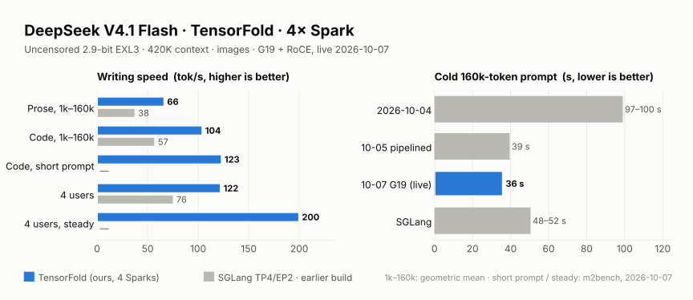

# DeepSeek V4.1 Flash on TensorFold, 4× DGX Spark

**Status (2026-10-07): serving on `forge:8000` on Jay's G19 engine ([below](#live-2026-10-07-jays-g19-engine)): 420K context, image input, pipelined prompt reading, the review fixes.** TensorFold replaced the SGLang TP4/EP2 deployment on 2026-10-04; that
deployment is stopped, not removed, and is the rollback (below).

The engine is [jayleaton/deepseek-v41-tensorfold-spark](https://github.com/jayleaton/deepseek-v41-tensorfold-spark):
TensorFold 0.6.0 plus his two-Spark DeepSeek V4.1 family, with exact DSpark speculative decoding, CED prompt replay,
Engram rows read from NVMe, sessions, structured output and DSML tool calls. We ported it to four Sparks; the recipe is
our fork, **[neko-legends/deepseek-v41-tensorfold-spark](https://github.com/neko-legends/deepseek-v41-tensorfold-spark)**. Weights:
[`dealignai/DeepSeek-V4.1-Flash-UNCENSORED-EXL3-2.9bpw`](https://huggingface.co/dealignai/DeepSeek-V4.1-Flash-UNCENSORED-EXL3-2.9bpw)
(~197 GiB, the same uncensoring team and method as the FP8 checkpoint SGLang served).

<picture>
  <source media="(prefers-color-scheme: dark)" srcset="../../../docs/images/lane-dsv41-tensorfold-dark.svg">
  
</picture>

## Results (2026-10-07, live: G19 on RoCE)

The same depth sweep as 2026-10-04 (median of 3 a cell, 512 tokens, greedy, isolated), on the live G19 server:

| prompt | 1k | 20k | 40k | 80k | 160k | geometric mean | 2026-10-04 |
| --- | ---: | ---: | ---: | ---: | ---: | ---: | ---: |
| prose, tok/s | 66.0 | 66.7 | 68.7 | 69.6 | 62.0 | **66.5** | 63.4 |
| code, tok/s | 107.2 | 103.5 | 105.0 | 101.7 | 103.4 | **104.1** | 100.2 |
| cold first token (prose / code) | 0.9 / 0.7 s | 6.0 / 5.3 s | 9.3 / 9.4 s | 17.9 / 17.8 s | **35.9 / 35.8 s** | | 99.8 / 97.4 s at 160k |

Four users at once (`dsbench`): **122.2 tok/s** aggregate (was 119.2).

On `m2bench` (one short prompt, 384 tokens, exact), the live build (q4 draft head, rotated expert split) runs **code 122-124 / prose 68-69 tok/s** for one user, and **four users ~200 tok/s steady** (138-139 aggregate including ramp), against ~80 code for Jay's two-Spark build on the same benchmark.

**From 2026-10-05 17:32 to 2026-10-07, the server ran on NCCL instead of RoCE without saying so.** A crash test left
RoCE's failure file `/cache/roce-failed` in forge's cache volume. While that file exists, every start uses NCCL.
Moving it aside gave +12% code and +19% prose on `m2bench`. The G13 vs G19 table [below](#live-2026-10-07-jays-g19-engine)
was measured in that state, so both of its columns are lower than this table.

Since 14:06 the drafter reads a 4-bit copy of the vocabulary head (`TF_DSV41_DRAFT_HEAD=q4`; exact, +1-2.5%). Where the rest of the time goes: [decode levers](../../../artifacts/tensorfold-v41-decode-levers-20261007/REPORT.md).

After a start, check that rank 0's log says `all-gathers ... over RoCE` and `plan link: rdma`.
[Report](../../../artifacts/tensorfold-v41-roce-20261007/REPORT.md).

## Results (2026-10-04)

| | TensorFold 4× Spark | SGLang TP4/EP2 (2026-10-02) | |
| --- | ---: | ---: | ---: |
| Prose decode, geometric mean over 1k–160k prompts | **63.4 tok/s** | 37.8 | 1.68× |
| Code decode, geometric mean over 1k–160k prompts | **100.2 tok/s** | 57.4 | 1.75× |
| `dsbench` 4-stream aggregate | **119.2 tok/s** | 75.7 | 1.57× |
| `dsbench` single-stream median | **62.6 tok/s** | 37.6 | 1.66× |
| Cold time to first token, 20k / 160k prompt | 14.2 s / 99.8 s (2026-10-05 pipelined: **5.8 s / 38.8 s**) | 5.5 s / 52.1 s | 2026-10-05: ~1.3× faster at 160k |
| Gates: arithmetic, forced tool call, tool continuation, strict JSON ×3 temperatures, reasoning | all pass | forced tool call fails | |

Per-depth tables, method and raw files: [artifacts/tensorfold-v41-4x-20261004](../../../artifacts/tensorfold-v41-4x-20261004/REPORT.md).

Read these with the differences in mind:
- **Different weight files.** 2.9-bit EXL3 on TensorFold against FP8 dense with FP4 experts on SGLang. Fewer bytes
  per token is most of the decode gain; this is a serving comparison on one cluster, not a same-weights engine race.
- **Expert pruning is on** (the recipe's production default, lossy: top-1 agreement 0.9944 vs 0.9961 unpruned in
  jayleaton's gates; about +5% decode). Delete its three `TF_DSV41_EXPERT_*` lines for the unpruned model.
- **One boot** of TensorFold; the SGLang rows are its published EP2 sweep.
- **Cold prompt reading is the weak spot.** A profiled 2,048-token prompt chunk spends ~0.73 s computing and ~0.40 s in
  exchanges between the four Sparks, one after the other. Overlapping them is the next change.

## Getting it

**Recipe: [neko-legends/deepseek-v41-tensorfold-spark](https://github.com/neko-legends/deepseek-v41-tensorfold-spark)**,
our four-Spark fork of jayleaton's two-Spark repository. Jay reviewed our pull request
([#6](https://github.com/jayleaton/deepseek-v41-tensorfold-spark/pull/6)) on 2026-10-05; his engine has moved on (G14-G19,
built around two ranks) and he preferred four-Spark support to live outside his default image, so we keep it in the
fork (decided 2026-10-05). Two Sparks: use [his repository](https://github.com/jayleaton/deepseek-v41-tensorfold-spark).

```bash
git clone --recurse-submodules https://github.com/neko-legends/deepseek-v41-tensorfold-spark
cd deepseek-v41-tensorfold-spark
```

The fork is his repository (engine G13) plus three engine patches the Dockerfile applies in order, so there is
nothing to apply by hand: `0003` four Sparks (TP=4), `0004` pipelined prompt reading, `0005` the uneven-slice bugs his
review found (2026-10-05, [below](#fixed-2026-10-05-the-bugs-jays-review-found)); plus `scripts/serve4.sh`,
`scripts/keeper4.sh`, `config/tp4.env.example` (the three prompt-reading switches on), `docs/FOUR_SPARKS.md` and
`docs/PREFILL_SPEED.md`. His two-Spark README is kept as `docs/TWO_SPARKS.md`.

## Setup on four Sparks

Needs: four Sparks on one switched subnet per CX7 port function, passwordless ssh from the head to the three workers,
~200 GiB for the pack and ~47 GiB for Engram shards on each node, and DeepSeek's original checkpoint (any node that
packs Engram shards reads its tables).

```bash
# 1. the pack on every node, same path
hf download dealignai/DeepSeek-V4.1-Flash-UNCENSORED-EXL3-2.9bpw --local-dir <MODEL>

# 2. Engram shards, on node r (r = 0..3)
python3 scripts/pack_engram.py --src <deepseek-ai/DeepSeek-V4.1-Flash> --config <MODEL>/config.json \
    --out <ENGRAM> --world 4 --rank <r>

# 3. image, config, copy to the workers, CUDA extensions
docker build -f docker/Dockerfile -t dsv41-tensorfold:tp4 .
cp config/prod.env.example config/prod.env && cp config/tp4.env.example config/tp4.env    # fill in both
bash scripts/serve4.sh ship
bash scripts/serve4.sh prebuild

# 4. serve; the first start writes ~50 GB of prepared weights a node (~5 min), later starts take ~35 s
bash scripts/serve4.sh start
```

[`docs/FOUR_SPARKS.md`](https://github.com/neko-legends/deepseek-v41-tensorfold-spark/blob/main/docs/FOUR_SPARKS.md) explains each setting. What bit us on the first boot:
- `TF_DSV41_PREFILL_ATTN_BMQ=16`: 16 heads a rank at TP=4, and 32 does not divide (since `0005` a 32 is clamped to 16).
- List both CX7 functions in `NCCL_IB_HCA`: a 2,048-row prompt exchange drops from 5.6 ms to 2.9 ms.
- A node with an unplugged port holding an address on the link subnet can drop TCP to that node (Linux keeps
  link-down routes): use the other subnet for ssh and NCCL sockets.
- Drop the page cache before a start (`MEM_GATE_GIB=104`); on GB10 cached files are GPU memory.

## Faster prompt reading (2026-10-05)


Patch `0004` adds three opt-in switches; we run all three (they are on in the fork's `config/tp4.env.example`):

```bash
TF_DSV41_PREFILL_PIPE=1024      # long prompts through the four Sparks as a pipeline (+~27 GB GPU memory a node)
TF_DSV41_INDEX_SPLIT=256        # short prompts: each Spark selects for a quarter of the rows (same bits)
TF_DSV41_PREFILL_OVERLAP=1024   # short prompts: exchanges behind compute (same bits)
```

Put them in `config/tp4.env` and restart (`bash scripts/serve4.sh stop && bash scripts/serve4.sh start`). A cold 160k-token
prompt: ~83 s → ~39 s; 20k: ~10.5 s → ~6 s. Memory: `MemAvailable` drops from ~50 to ~26 GB a node. How it works, the
numbers and the checks: [`docs/PREFILL_SPEED.md`](https://github.com/neko-legends/deepseek-v41-tensorfold-spark/blob/main/docs/PREFILL_SPEED.md), and
[artifacts/tensorfold-v41-prefill-20261005](../../../artifacts/tensorfold-v41-prefill-20261005/REPORT.md).

## Fixed 2026-10-05: the bugs Jay's review found

Patch `0005` in the fork, serving since 2026-10-05 11:30. Jay's review of our pull request found bugs that only
uneven slices or four ranks expose; the worst one bit our own server. A sampled request asking for more candidates
than the narrow vocabulary slices hold (`top_k` above 32,256, or a JSON request with nucleus sampling, which asks for
the whole vocabulary) made the four Sparks exchange unequal sizes: the old build answered `top_k` 40,000 with an
illegal memory access on ranks 2 and 3 and the server went down. Fixed, together with the trimmed draft head, the plan
link's rank handshake, `--tp 4` scope, the BMQ clamp and the session tier's world size. Testing it on the Sparks
found one more: the first very wide request after a boot still timed out the followers until the candidate kernels
were warmed at boot.

| check on the 0005 build | result |
| --- | --- |
| 20k / 160k replies vs the 0004 build | byte-identical; cold first token 5.8-6.8 s / 38.8-39.0 s, as before |
| decode, A/B in one window (two boots each, alternating) | the same within run-to-run noise |
| hidden code word at 30 / 60 / 85% of 20k / 80k / 158k prompts; short gates | 3 / 3; 7 / 7 |
| nucleus, nucleus + min_p, `top_k` 40,000 and 32,000, `top_k` 20, JSON nucleus | 6 / 6 (the 0004 build: down at `top_k` 40,000) |
| `top_k` 40,000 as the first request after a boot | answers |

Details and every run: [artifacts/tensorfold-v41-fixes-20261005](../../../artifacts/tensorfold-v41-fixes-20261005/REPORT.md). How the recipe was tested (the patches rebuild the engine file for file; 327 CPU tests pass on that tree, 2 older
failures unrelated to four Sparks; the image built from a fresh clone; the Spark test windows):
[the fork's README](https://github.com/neko-legends/deepseek-v41-tensorfold-spark#how-it-was-tested-2026-10-05).

## Live 2026-10-07: Jay's G19 engine

Our four-Spark port of his newer engine, now the fork's `main`, serving since 2026-10-07 00:06. The G13 build it
replaced, measured in the same window (one boot each, 512-token replies, two trials):

| | G13 build | **G19 build** |
| --- | ---: | ---: |
| decode, prose 1k / 20k / 160k (cold, tok/s) | 53.1 / 50.1 / 47.5 | 54.5 / 50.3 / 48.6 |
| decode, code 1k / 20k / 160k (cold, tok/s) | 88.9 / 80.8 / 84.9 | 90.7 / 82.3 / 86.2 |
| cold first token, 20k / 160k | 5.9-6.7 s / 38.9-39.1 s | **5.4-6.0 s / 35.9-36.2 s** |
| context a request slot | 300K | **420K** (KV pool 1,201,152 tokens, independent of the context) |
| image input | no | **yes** (DeepSeek's ViT on rank 0) |

Both columns ran on the NCCL fallback (above), so their decode numbers sit below the RoCE table at the top.

| check on the G19 build | result |
| --- | --- |
| code word at 30 / 60 / 85% of 20k / 80k / 158k-token prompts, and at 50% of a ~405k-token prompt | 3 / 3, 1 / 1 |
| short gates; nucleus, `top_k` 40,000 / 32,000, JSON nucleus | 7 / 7; 6 / 6 |
| image question (red / blue halves) | "Red and blue" |
| greedy reply vs the G13 build | byte-identical |

What changed: G19's prompt-reading speed switches and fused dense prefill (~7% at 160k), the context and image
input, and his fail-fast and memory fixes at four ranks. Writing speed is unchanged within noise: the per-token
plan link over RDMA was worth only ~1-2% at four ranks. One setup trap: the image routing bias must be in the cache
volume on **every** node (one node had missed the download; that rank refused to start).

Jay's PR review asked for a smaller patch for his repository: four ranks and the review's fixes only, two-Spark
output unchanged. That version (the fork's `four-sparks` branch) gives byte-identical replies at TP=2 against his
main on two of our Sparks (9 / 9 requests, the same tok/s). Details:
[artifacts/tensorfold-v41-g19-20261005](../../../artifacts/tensorfold-v41-g19-20261005/REPORT.md).

## Our installation (forge, anvil, ember, flame)

| | |
| --- | --- |
| launcher | `/home/jun/tf4/serve4.sh` with `/home/jun/tf4/tp4.env` (port 8000 on all interfaces, link 192.168.10.x); image `dsv41-tensorfold:tp4g19b` (the fork's `main` on G19, with `config/tp4.env.example`'s G19 block: 420K context, images, RDMA plan link, fused dense prefill) since 2026-10-07 00:06 (rollback: `/home/jun/tf4/pf/tp4.env.before-g19` for the G13 build `tp4m6`; older: `pf/tp4.env.before-m6`, `before-fix`, `before-pipeline`). `/v1/model_info` and the `vllm:` series on `/metrics` report the 4 request slots; sparkDash (`dgx-dash.service` on eva-core, DGX-dash `4d27fd1`) shows 4, and Eva's router sizes its concurrency from it |
| keeper | `/home/jun/tf4/keeper.sh` from cron: starts 4 min after a reboot, restarts after 3 failed health checks; pauses while `/home/jun/tf4/maintenance` is newer than an hour or an SGLang head container runs |
| model names | `deepseek-v4.1-flash` (alias) and `DeepSeek-V4.1-Flash-TF`; thinking on by default (effort 75), `chat_template_kwargs.thinking=false` turns it off |
| rollback to SGLang | `touch /home/jun/tf4/maintenance && /home/jun/tf4/serve4.sh stop && python3 /home/jun/tensorfold-native-20261002/restore_ep2.py` (the keeper stands down while SGLang runs) |
